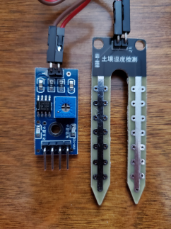

<p align="center">**Building a Talking Sump Pump Level Monitor**</p>

<p align="center">Gary Dyrkacz, August, 2021</p>

**1. INTRODUCTION**

The goal of this project was to get voice alert message from our Google
Home Mini speaker, if our residential sump pump failed, leading to a
high water level in the sump pit. The goal succeeded. This discussion
leads through the thinking process, a biased review on sensors and
output methods, and details of the path finally executed.

The path to the goal turned out to be amazingly frustrating and
convoluted. The Internet of Things relentlessly hypes the glories of
controlling your devices, but typically buries the one-sidedness of that
conversation. Having a device initiate a vocal conversation such as,
"Hey, the basement is filling up with water." or "Hey, it is really
getting hot and humid in here. Did the AC breaker kick out again?", is
harder, especially if you want to use, what I at least, consider a
logical speaker choice: your Google Home Mini or Hub speaker, or Amazon
Echo.

Of course, you can ask for information from all these apps and devices,
but what good does that do when the water level is rising silently in
your basement. I don't have my cell phone tied to my body 24 hours a
day. I find it remarkable that with all the hoopla surrounding IoT,
communication is so one-sided at this stage of development.

Devices can send you emails, messages, or notifications to computers,
tablets and phones, but invariably these end up as some sort of visual
screen app, rather than voice notifications or alerts. However, some
third party services, such as IFTTT, can make direct calls to a phone
and play a recorded message. From the perspective of the DIY person
interested in microcontrollers and specific sensors, this seems a real
desert of choices. My experience documented here, comes to the rationale
that the activation energy for truly integrating a controller with
speaking devices, such as Amazon Alexa's or Google Home Mini's is high.
However, it can be done. in a very roundabout fashion, with a clever
Arduino ESP32/8266 library. One hope is that this document acts as a
catalyst for other to reduce the activation energy.

**1A. The Stage**

We own a multilevel house with a basement. As with most basements, there
is a sump pump. The pump is a Model 53 Zoeller submersible pump. The
water level is maintained by a float that rides on a vertical rod
suspended between a flexible bottom arm and a spring loaded switch lever
arm at the top. As the water rises, the float rises, ultimately raising
the switch arm, triggering the pump. As the water drops, the float
drops, and the pump turns off. Simple enough.

Over many years, two pump problems became obvious: Almost like
clockwork, every three years the trigger switch needs to be replaced,
because the switch contacts degrade due to electrical arcing when
contact is broken as the float drops. Replacement switches are
available, and removing the waterproof switch housing to replace the
switch is straightforward, but not instant.

The switch lifetime renders itself obvious, by what I call a "double"
trigger effect, where the pump kicks in, kicks out early, and kicks in
again several seconds later. This happens over several weeks, so there
is usually plenty of warning time to replace the pump with a waiting
back up. The bad switch is replaced and the repaired pump becomes the
backup for the next three year failure. Although it would be nice to
have a way to monitor for this problem, it is a fairly complicated
sensor detection problem, which I hope to get around to dealing with.

The second issue is a more immediate problem. It is my belief that the
specifications on the switches have gotten sloppy and some switches,
below a certain temperature, increase the spring tension required to
trigger the switch, just enough, so that if the liquid level rises very
slowly, the float fails to trigger the switch, leading to a high water
level and potential flooding of the basement. This problem is what this
project is all about.

Why do I continue to use a pump that has these problems to begin with?
No pump lasts forever, but these pumps come close enough for me. With
two of these cast iron pumps, if one misbehaves, I can change over
rapidly. I finally had to replace one pump after 30 years, because the
threads on the outlet side rotted out beyond repair. Moreover, I know
the pump; I know its characteristics, and I don't have to re-engineer my
entire sump pit and piping to fit a different pump. It is also a fairly
powerful 1/3 HP pump, which is needed to raise the water from a deep
basement..

Already In place was a cheap, battery operated siren alarm to alert us
that the level was too high. This device uses two separated disk
contacts. When water gets between the contacts, the circuit is completed
and the device alarms. This alarm is not really designed for how I use
it. The disc contacts are supposed to be against the floor to detect
water, but I have it suspended in the sump well. I modified the plastic
mount holding the contacts, because water would hold up on the plastic
mount and prevent the alarm from shutting off until manually dried off.

The problem with this simple alarm is that, in a multilevel house, with
the alarm in the basement, we are unlikely to hear the alarm from most
rooms in the house. When the alarm is heard, the "fix" is to just go
down and gently tap the outlet pipe of the sump, which is enough to
trigger the pump. Yes, it would be nice to have something automatically
trigger the float, but that is another future project.

So the task is to supplement this alarm with something that provides a
more positive alert system.

One other problem with this project: Me. I am a neophyte in about 70% of
what I will discuss. I came in to the Arduino Uno and ESP world knowing
a moderate amount of python and Excel VBA programming, and a little bit
about electricity/electronics, but most of that knowledge was only
marginally useful on this project. I have learned enough about
electronic components, Arduino IDE C++ and nodejs/javascript to get by
with massive help of the internet, but still fuzzy on deep electronic
circuit details. As far as all the Actions on Google stuff I will
discuss...I found my initial experience daunting.

I read a lot; I thought a lot; I likely over-thought a lot; I
experimented. Finally I made it all work, but with more perseverance
than I suspect most people have time for. I do not want to just know the
how of a thing, but also the why of a thing. Hours and in some cases,
days, were spent going down wrong paths, learning about electronic
components, sensors, software applications, or codes to understand the
hidden nuances that are often the root of "gothca's". I learned a lot
about limitations and pitfalls, many of which will be mentioned here.

My lack of experience may be positive for some readers who are in a
similar position to me. I will go into the logic behind many of my
choices, and give details on aspects that professionals often do not
provide, because of either fear of not looking professional, or because
of such complete knowledge of the topic, they have forgotten their early
struggles.

There was enormous help from blogs and forum questions. A fraction of
the stuff I researched is specifically mentioned here. In some cases,
even one sentence in an article, or discussion put me on the right path,
and in thankfully far fewer cases, sent me down the wrong path.

This discussion will not be appropriate for raw beginners in the world
of microcontrollers, sensors, coding, and IDE's. Read or view the great
tutorials from others, maybe even try a few things, and then come back
here. The expectation is that you are somewhat familiar with what an
ESP8266/ESP32 is, what a Arduino IDE and sketch is, and have some sort
of coding experience. What you will need, if you seriously want to
proceed: Some knowledge of C++, and nodejs/javascript, but familiarity
with any coding will be sufficient to understand most of what is going
on. (From my perspective, nodejs/javascript has some curious differences
compared to python and C++.).

Another cautionary note: This is a whopping, long document, because it
draws together a number of different elements. I could have broken it
into four separate documents, but instead kept it as one big document
with four sections.

**2. HARDWARE**

For hardware, you will need:

  - an ESP32, or ESP12,

  - a breadboard,

  - wire: preferable thin two wire cable, some male to male jumper
    wires, additional 20-24 gauge wire for final connections.

  - a cheap. soil hygrometer moisture detector with a LM393 comparator
    module, or a LM393 comparator chip with some resistors, or a
    separate comparator module.

  - prototype PCB perfboard.

You will need some ability to solder. Some familiarity with at least
hand tools is necessary, or better small power tools. You will need a
Google Account so you can use Google Sheets, a Google Cloud service
account, i.e., an account connected to a charge card account, if you
want to ability to ask about the history of your alarms. At a minimum,
you will also need Google Assistant and for audio output you will need a
Google Home Mini, or Google Hub. My desktop system is a Windows 10 based
computer, and so all information is biased to that operating system.

3. **PROJECT EVOLUTION**

I will break down the project into eight parts:

1.  A cursory review of what was available already in the ESP8266 and
    sensor world.

2.  Why I chose an ESP32 for the project.

3.  A cursory review of several types of sensors that might be used to
    monitor levels.

4.  How to make one example of a simple two contact "sensor" device for
    triggering an ESP32. (Sounds more technical than it is.)

5.  Why I went with a Google Account, and how to use you Google Account
    to set up a Google Sheet, and underlying nodejs code to receive and
    log the data.

6.  The Arduino IDE based ESP32 C++ code to monitor a simple sensor, and
    send alarm notices to a Google Sheet.

7.  How to simultaneously allow your Google Home Mini or Google Home
    device to announce an alert or alarm, from the ESP32 C++ code. (One
    sided communication in this case.)

8.  How I translated the breadboard circuit to a deployable permanent
    case.

9.  Set up an Actions on Google application using Google's Actions
    Builder to use Google Assistant, in conjunction with Google Home
    Mini or Hub to query the Google sheet for historical alarm
    information.

Almost everything I discuss is available from other online sources, and
examples. I just modified and put the pieces together to fit my
particular needs.

**3A. What was available already?**

Of course, rather than reinvent the wheel, if there was already a good
match for what I wanted to do, I was in favor of siphoning off that
project. Much of what I found was monitoring the level of water or other
liquid storage tanks. Certainly, there are many commercial plug and play
systems to do this, but I wanted a cheaper, do-it-yourself (DIY)
approach.

There are quite a few efforts on the internet about monitoring a sump
pump, which run the gamut from just alerting to a high water or moisture
level. to monitoring the actual water level or power cycling of the
pump. Many reports are very detailed with pictures and code.

A few that particularly caught my eye on detail will be mentioned, but
certainly not all:

*Arduino ESP32 DIY Water Level Sensor and DIY Level Indicator* *From
\<<https://create.arduino.cc/projecthub/Pedro52/arduino-esp32-diy-water-level-sensor-and-diy-level-indicator-3d513d>\>
*

This is a quite nice set up, but a lot of work to put together for
continuous monitoring. This project uses an ESP32. The sensor consisted
of a 6 resistor array in a tube, with wires of various lengths in the
tube that would make contact with water at various heights in a step
fashion. A 200 ms pulse is sent on an output pin every second, and the
analog signal read. The level is then translated to a set of LEDS for
readout. The pulsing is used to avoid hydrolysis at 3.3V, with the
copper wire.

*Water Level Alarm Using Arduino*
*\<<https://www.instructables.com/Water-Level-Alarm-Using-Arduino/>\> *

This is as simple as it gets, two wires, using the 5V source from the
Arduino and monitoring the voltage across the wires, with an LED as an
indicator. Again, for continuous monitoring.

*MQTT/Google Home Flood/Water WIFI Sensor With ESP-01* *From
\<<https://www.instructables.com/MQTTGOOGLE-HOME-FLOODWATER-WIFI-SENSOR/>\>*
This is another bare wire sensor, operating in continuous mode. The data
is sent to a node-Red server, via MQTT with mosquito broker. A small
speaker is added as a local alarm. Supposedly, the node-Red system is
interfaced to several Google Home devices, but I was unable to
understand how.

*ESP8266 Basement Monitor*
*\<<https://www.instructables.com/ESP8266-Basement-Monitor/>\> *

This project used a simple two state cheap commercial vertical float
sensor (normally open), and a temperature/humidity sensor with an
ESP8266, to monitor ambient conditions and a sump pump in a basement.
The data was sent to a web server site, where the system could be
monitored via a dashboard. There is insufficient information on mounting
the float switch, but see:

*Magnetic Float Sensor – Arduino* *From
\<<https://roboindia.com/tutorials/arduino-magnetic-float-sensor/>\> *

as a better example of how to wire up an Arduino.

*Sump Level Monitor
\<<https://create.arduino.cc/projecthub/Mudshark/sump-level-monitor-63053f>\>
*

This is a very clever project that monitors the water level
continuously. It is based on the use of a sensitive pressure sensor, and
an Arduino Nano, with a visual OLED display.

*Current Monitor and Water Sensor for Sump Pump* *From
\<<https://automatedhome.party/2017/03/24/current-monitor-and-water-sensor-for-sump-pump/>\>*
Uses a Wemos D1 mIni and a non invasive current transformer to
continuously sense the power going to the sump pump. The data was sent
to an MQTT broker and Home Assistant to monitor the information.
Although no details are provided, the author mentions that an attempt to
use a vibration sensor to monitor the pump activity failed due to lack
of sensitivity.

*How we are monitoring a sump pump with an ultrasonic distance sensor
and home assistant.* *From
\<<https://www.reddit.com/r/smarthome/comments/kpmjvv/how_we_are_monitoring_a_sump_pump_with_an/>\>*
This article and the link discuss monitoring a sump with an HC-SR04
ultrasonic sensor.

*Sump pit water level monitor.* *From
\<<https://www.youtube.com/watch?v=jlrmCSBibKY>\>* This video serves as
more a warning on not using an HC-SR04 ultrasonic sensor in a highly
closed environment.

In addition, there are numerous projects discussed online to monitor
liquid levels, or power cycles that are not directly related to sump
pumps, but are applicable to the problem. Compiling and discussing these
in detail is a project by itself, and gets too far away from the project
here. I did probably read the majority of these in deciding on how I
would approach my problem.

Several water level monitoring projects, particularly with battery
power, that I found interesting and useful enough to mention:

*SOLAR POWERED WATER LEVEL SENSOR MODULE USING ESP8266* *From
\<<https://www.techzonemind.com/solar-powered-water-level-sensor-module-using-esp8266/>\>*
This project was interesting because of its use of a solar panel to keep
a rechargeable battery charged to run and ESP-01 module. An HC-SR04
ultrasonic sensor was used for level detection. Of course, not the ideal
system in a dark basement.

*[ESP8266 Water Alarm
(benlo.com)](http://benlo.com/esp8266/esp8266WaterAlarm.html#WaterAlarm)*
Uses a ESP-01 with a special push button circuit switch (Pololu 2808
latching power switch) that can also be triggered by a pulse. This was
used as a high water level alarm in a brine tank. The "sensor" is two
separated bare wires. The data is sent to a server, but could be sent to
a third party, like IFTTT for handling and notifications. The Pololu
switch has a very low quiescent power requirement.

*Wireless, Battery-Powered, Water Detector From
\<<https://github.com/andres-leon/wireless-water-detector>\>* This is a
fairly complicated set up, and really an extension of the above idea. It
incorporates a number of features that other systems use or can use, in
different combinations to run a water level monitoring system
intermittently. It uses a simple bare wire type sensor, with a TPL5110
timer to periodically trigger the latching circuit switch to maintain
power until the ESP-01 can send a notification to an MQTT server and
Home Assistant.

*Water level/fluid level capacitive sensor - How it works and how to
make one.* *From \<<https://www.youtube.com/watch?v=Z-1X4IoChiY>\>*
Excellent video and description on making and using a capacitive sensor.
This is for continuous monitoring though, and requires a fair amount of
power to operate.

With this cursory review, I will discuss aspects of why I chose the path
I did for this project.

**3B. Microcontroller**

A very early consideration to use an Arduino Uno with some sort of
sensor went away fast. Hooking a speaker to the Arduino, was no better
than the alarm I already had in place, and adding some sort of
microprocessor to the Arduino, was useless, because there was no
internet lines to directly tap into. I was not keen on drilling holes
through floors and walls to install wiring to bring the alarm to the
upper rooms, even though I have the tools and expertise. Nor did it make
sense to add an ESP8266 to an Arduino.

Immediately that moved the project to using an ESP8266 or ESP32
controller to use wifi. I already had both ESP01's and ESP32's for other
project ideas, and I had an ELEGOO Arduino UNO R3 kit with a number of
sensors and peripherals at my disposal.

A question that sent me into a long research phase was whether to use
battery power or line power. I obviously have power nearby to run the
sump pump, but the idea of using battery power was initially attractive
because the controller could be mounted anywhere.

Batteries as a power source for any microcontroller project is all about
special attention to power management. if a sensor monitors a condition
continuously or even at timed intervals, then we need to know the
quiescent power draw between read outs, and time and power draw that the
sensor needs to take and transmit a measurement, and even the circuitry
that regulates and supplies the power. If sensing is based on an
external event trigger, such as some sort of switch closing, power
requirements generally will be reduced. but we still have to worry about
quiescent current draw. Depending on the sensor, especially range or
distance type sensors, power consumption is generally in the realm of 1
to 20mA in quiescent mode. Such power draws are bad news from the
standpoint of long term battery operation.

For example, a common idea is to use a cheap ultrasonic HC-SR04 distance
sensor to monitor liquid level. This sensor continuously draws 2 mA
quiescent power and 15 mA when triggered. So even without triggering any
periodic distance measurements at all, a 2000 mah battery would last
around 40 days, not even considering the power needed by the ESP. Even
with deep sleep modes, an ESP8266 or ESP32 (with the exception of the
ESP-01), will draw between 6 and 20 μA, because there is battery drain
to keep the chip's real time clock (RTC) running. Depending on how it is
set up, approximately 170 mA or more are needed when transmitting and
receiving data. Transceiver up time can vary, but most likely will be
under 10 seconds for simple transmission of data. In addition to the
sensor power requirement, a regulator may be required to provide a
stable voltage. Every regulator draws some power on its own, but there
are very low power regulators available. (A "gotcha" in this case (for
us neophytes), is that most of these regulators are surface mount,
requiring some very good soldering skills.)

Many cheap off-the-shelf ESP12 NodeMCU modules have a relatively
inefficient regulator which adds to the power drain in deepsleep mode;
they also have onboard LEDS that further reduce battery life, and need
to be removed. Worse, there is a memory limit on the RTC which forces
the ESP8266 to wake up every 71 minutes and be put back to sleep,
further reducing battery lifetime. There are tricks to reduce the power
consumption, such as using a portion of the RTC memory to hold sets of
measurements, and then burst send all the data:

*\#60 How to use the RTC Memory in ESP8266 and reduce power consumption
by factor of 10 (Tutorial)* *From
\<<https://www.youtube.com/watch?v=r-hEOL007nw>\> *

*Deep sleep: Use RTC memory to store data (ESP32 + Arduino series)* From
*\<<https://www.youtube.com/watch?v=ij-hjzv6QKY>\> *

This data storage trick, or even using an efficient independent RTC, is
not appropriate for a real time alarm system.

As suggested by some of the mentioned articles, if the alarm rate is not
too high, as with a simple high level only alarm, a battery operated
ESP-01 can be a viable option. The ESP-01 8266 is a bare bones module.
It has no LEDS and no voltage regulator. In all likelihood, a voltage
regulator is needed to maintain a stable power supply even with a
battery, but it can be paired with a very low quiescent power regulator.

At its simplest, when water breaches the contacts connected to a
battery, current will flow, triggering the ESP-01 to send a message to
either a local server, or a third party server, such as IFTTT, to end up
as some kind of alert. There may be issues with this set up. Water from
the tap, or ground water is generally not the best conductor of
electricity. This translates to a high resistance across the contacts,
leading to insufficient voltage to trigger the ESP-01. This can be
alleviated by using a low power op amp/comparator circuit to boost the
voltage/ Second, the ESP-01 CH\_PD power down pin, also called the EN
pin, must be pulled and held high to boot the ESP-01, and it must be
kept high until the ESP-01 has finished its transmission. if the water
level drops before the ESP-01 completes an alert transmission, breaking
electrical contact with the battery, the controller will shut down early
and we would miss the event being logged. This can be resolved by using
a timer chip or module, such as the low power TPL5111 module, which has
an enable pin to start and stop a preset timed cycle. allowing the
ESP-01 to complete its transmission. The TPL5111 has a low quiescent
power draw of around 50 nA. An excellent example and explanation of the
this kind of circuit is:

*Battery Powered Door Sensor With Home Automation Integration, WiFi and
ESP-NOW* *From
\<<https://www.instructables.com/Battery-Powered-Door-Sensor-With-Home-Automation-I/>\>*

and this discussion may help:

[*Ultra low power 555 timer
circuit*](https://electronics.stackexchange.com/questions/216379/ultra-low-power-555-timer-circuit)
*From
\<<https://electronics.stackexchange.com/questions/216379/ultra-low-power-555-timer-circuit>\>
*

The solution of an ESP-01, a battery, an op amp to raise the voltage on
the digital pin, and the timer module to ensure transmission time is a
workable solution, but in the end, was not implemented for a couple of
reasons. By the time all the components are assembled, a low quiescent
current MOSFET voltage regulator, the comparator chip and the timing
chip, the cost is comparable to a more advanced ESP32 module. Second, a
possible future development for monitoring the sump pump was to add an
additional sensor to monitor the cycling of the sump pump, which
requires continuous monitoring.

Although a ESP12 would work for continuous operation, I decided to use
one of the already in hand ESP32 modules. By my standards they were
fairly cheap, and offered a lot of options. These modules are also much
easier to program than the ESP-01 because they have a built in serial
chip and USB connector, as well as a large number of analog and digital
pins.

**3C. Sensors **

I already discussed some sensors. For liquid level monitoring, there are
several that have received a lot of attention. I will briefly mention
the most common. Be aware that some of these require additional support
electronics to operate, and I am glossing over construction details.
Refer to the articles or similar articles for more information.

***3C.1 Continuous monitoring sensors***

**3C. 1.1.**Two contact sensors

These are the simplest types of sensor, consisting of two conductive
arms. I have already mentioned their use in the short sump pump
monitoring review above. However, the below reference is a must read
with an important cautionary note on this type of sensor, and
secondarily, a good starting reference on capacitive sensors discussed
further below:

*\#207 Why most Arduino Soil Moisture Sensors suck (incl. solution)*
*From \<<https://www.youtube.com/watch?v=udmJyncDvw0>\> *

This video by Andreas Spiess, as most of his videos, is great. This one
specifically deals with water/moisture sensors, and discusses in detail
why continuous monitoring with simple resistive probe sensors is not a
good idea.

The problem is electrolytic corrosion of the copper with DC power. From
theoretical thermodynamics, water can be split into hydrogen and oxygen
at 1.23V, but pure water requires a large overvoltage to generate
hydrogen. Ions in the water reduce the required overvoltage. The minimum
is closer to 1.5V or more, if there is some salt dissolved in the water.
Clearly, the voltages used in the sensors are greater.

**3C.1.2.** Ultrasonic sensor

Ultrasonic sensors particularly stand out for conveniently measuring
distance, including water as a target. The cheapest and most commonly
described is the HC-SR04. From a learning standpoint, this is a fun
sensor to use. However, from a practical view point, it has problems; it
is not waterproof. When you consider the environment of a sump pump pit,
with its high humidity, potential for splashes leading to corrosion, or
short circuiting, and a variety of insects, it is just not that great a
fit. Of course they are cheap, and you can just swap them out fairly
quickly, if one fails.....and you know it has failed.

There are waterproof ultrasonic sensors, that are the same or similar to
those used in vehicles. These tend to have much higher power
requirements and are more expensive. Their minimum distance to target is
specified as 20 cm, which in my case was too long a minimum range to
easily mount in our sump pit.

**3C.1.3.** Capacitive sensors

Another interesting continuous sensor type are those based on
capacitance. There are commercial sensors available that can be used
with an Arduino or ESP8266. The previous article I referenced on
capacitive sensors as a sump pump monitor is excellent; it shows how to
calculate the input and output parameters, and build your own capacitive
sensors. Capacitive sensors may require some sort of pulse generator to
work, or an RC circuit. Another article on a homemade capacitance sensor
is:

*Capacitive Fluid Level Sensor Information* *From
\<<https://www.instructables.com/Capacitive-Fluid-Level-Sensor/>\> *

This is a very good article on a homemade capacitance tube sensor that
uses the charging principle of a capacitor to determine the capacitance
and translates that to the liquid level.

**3C.1.4.** LIDAR sensors

An interesting variant on a distance sensor is the use of a laser
distance sensor, which is based on the lidar principle. This article
provides a good introduction:

*How to Use Arduino + VL53L0X to Build a Liquid Level Sensing Device
From
\<<https://maker.pro/arduino/projects/how-to-use-arduino-vl53l0x-to-build-a-liquid-level-sensing-device>\>
*

By itself, the VL53LOX sensor module ( or the VL53LIX longer range
version) has an exposed laser and detector element. Definitely, not a
good idea in the kind of environment we are considering. This sensor
really needs a waterproof, protective window and housing. When a cover
window is added, there is a large drop in usable distance. it is
important to use a window material that is as transparent as possible to
the 940 nm laser light, and is as optically clear as possible, and
parallel to the sensor elements. See my take and some experiments on
this chip:

*VL53L0X Experiments and Creating a Prototype Mounting Board.* *From
\<<https://github.com/GaryDyr/VL53L0X-LIDAR-ToF-Experiments>\> *

**3C.1.5.** Pressure sensors

Another interesting sensor for liquid level measurements is an MPXV5000
or 7000 series air pressure transducer sensor, especially the MPXV7002DP
sensor and breakout board:

*Sump Level Monitor* *From
\<<https://create.arduino.cc/projecthub/Mudshark/sump-level-monitor-63053f>\>
*

There is not a lot of detail in this video, but does suggest the
capabilities of the sensor in the right pressure range of +/-2 kPa or
0-4 kPa.

Another potential pressure sensor for liquid level monitoring is the
MS5611 atmospheric pressure sensor module.

*Arduino Atmospheric Tape Measure/ MS5611 GY63 GY86 Demonstration From
\<<https://www.instructables.com/Arduino-Atmospheric-Tape-Measure-MS5611-GY63-GY86-/>\>
*

I have not found this module being used as a level sensor, but the
pressure range appears to be applicable. A possible drawback is the chip
is exposed. it may be possible to use a flexible membrane of some sort
to act as a barrier between a hostile environment and the sensor module.
The quality of the Arduino libraries for this sensor is not clear.

**3D. Single event sensors (normally open/normally closed switches)**

In contrast to the previous sensor, single event sensors are those that
do not continuously expend power to work. Generally, they have just an
on or off state, like a switch, and therefore provide a onetime snapshot
of the state of the sensor. They are used mainly to provide an alarm
condition for a low or high liquid level. In that sense, they are
typically more robust than the continuous sensors

The simplest for conductive liquids is two wires or metal contacts in an
open wire condition. When a conductive liquid forms a bridge between the
contacts, current flows from the source, and the voltage difference
triggers a digital pin on the processor. In general, when using this
simple type of system, it is good practice to use a 10K pull up or pull
down resistor, whether internal or external to the processor to avoid a
floating voltage on the controller pin.

One step above bare contacts is the two state commercial vertical float
switch, which are variants of magnetic reed switches. These do not
depend on conductivity of the liquid to complete a circuit. These
switches are small and versatile, and use a tiny magnetically sensitive
piece of metal (reed) to close or open a circuit. I have already
indicated an example of this switch in the previous section. (However,
note that for the reasons mentioned above, the Arduino internal pull up
resistor is used. For an ESP specific version, take a look at this
reference:

*IoT Based Smart Water Tank Monitoring System using Float Sensor and
NodeMCU From
\<<https://iotdesignpro.com/projects/iot-based-water-level-indicator-using-float-sensor-and-nodemcu>\>
*

Reed switches are also cheap.

**4. HOMEMADE SUMP SENSOR**

I seriously considered the reed sensor, because of its simplicity, but I
did not go that route. Small, cheap, float switches are readily
available, for example from Amazon, but a number of Amazon reviews noted
hang ups with the float. That put these switches in the same class of
problem that I was trying to create an alert to fix. I also had
misgivings about how well the wiring was sealed to the switch body,
because I anticipated, at times, the entire switch could be under water,
including the wire connection to the switch. However, according to
reviews that did not seem to be a problem. The most common problem
appeared to be naive buyers applying too high a voltage across the reed
switch, frying it.

Instead, I decided to use a simple two probe contact sensor. There are
two common commercial varieties of these sensors in the Arduino world.
One, shown in the first photo below, is a twin fork probe, and the other
is a series of conductive lines on a single board. Both of these sensors
are quite small, around 4 cm long. If not caught early enough, the level
of water in the sump pump could easily cover the entire sensor and short
it. In addition, this would likely lead to liquid remaining on the
plastic areas, meaning the voltage would not drop to zero when the water
level dropped.

As already noted, the conductivity of the water is an important
consideration. Conductivity is the reciprocal of the resistivity. By
definition, specific resistance is used to get conductivity, and is
defined as the resistance of two 1 cm plates spaced 1 cm apart. Sensors
that measure conductivity have a multiplier to compensate for non
standard shapes, distances, and power supply. Pure water is ~18.5 MΩ or
a conductivity of 0.055 microSiemans/cm. CO<sub>2</sub> forms carbonic
acid in water, and the CO<sub>2</sub>/ carbonate/bicarbonate equiibria
drops the resistance to below 8-10 MΩ. Of course, dissolved salts will
further lower the resistance.

We should expect the water resistance will always be relatively high. To
possibly display some of my circuit ignorance by way of explanation:
There will be a large voltage drop across the probe contacts because of
the high resistance between the contacts. Thus, if the probe was
directly connected to the ESP, I believe there would be only a small
voltage seen at the controller pin, and it might not be sufficient to
trigger the pin HIGH. Both of the commercial sensors mentioned have some
means of amplifying the residual voltage, or triggering an op
am/comparator circuit.

In principle, we could monitor the analog voltage, while placing the
probe in the water at certain heights. (Note that an ESP-01 does not
have any analog pins.) From this data, we could develop a correlation
between voltage output and the water level. In practice, this is not
likely to work well. An applied voltage across the probe fingers will
vary depending on the concentration of dissolved ions, time for
equilibration with carbon dioxide in the air, the shape and area of the
probes exposed to the fluid, and the distance between the conductive
probes. The conductivity may even depend on the flow rate of the water
through the soil and its length of stay in the sump pit. In a bad
rainstorm, water may not have time to reach ion equilibration with the
soil. A more reliable monitoring approach is to convert the small
voltage, whatever the output, to a HIGH or LOW digital input signal
using the comparator circuit to register the presence of water.

The very cheap soil hygrometer moisture detection modules mentioned
previously are widely available. This is an example of a common and very
cheap type:



 

It consists of the conductive fork, which is connected to a small module
containing an LM393 comparator chip, which is then connected to the
microcontroller. These sensor modules can output either a digital logic
signal or analog signal to a microcontroller. The arms or prongs of the
probe are completely conductive; they have minimal resistance.

As suggested by the excellent review by Spiess (see previous reference
in Continuous Sensor Section), the pronged probes degrade. Although
great for demonstrations, they are not acceptable for long term
measurements. What is more useful, is the LM393 module. You can buy
similar separate LM393 modules, which may or may not be more robust, but
they turn out to be more expensive than these kits, which can be
purchased for about $1.50 apiece. The advantage of these modules
relative to purchasing the individual components is that they already
have the pins and a variable resistor that can be adjusted to set the
minimum trigger point to output a digital HIGH or LOW signal.

Certainly, as a non continuous high level alert sensor, degradation of
the probe due to galvanic action would be minimal. However, it is likely
that on occasion, the water level in the sump pump would completely
submerge the probe. In that case when the water level dropped the area
around the pins would still be wet and keep triggering an alarm.
Therefore, it was necessary to make my own long twin fork probe.

***4A. DIY sump pump probe***

My probe has a unique design, only because it turned out to be made from
a convenient piece of scrap material I had lying around; It is a 24"
section of semi-flexible hanging light monorail. The original ceiling
rail light fixture had to be replaced because of very bad design flaw in
the rail connectors, but I kept the rails, as "too good to throw away"
and "maybe for some future project". This project was it. The rail
consists of two exposed aluminum rails with an integral plastic
insulator sandwiched between them. The plastic between the aluminum
rails was sliced away with a Dremel cut off wheel, filed smooth, and the
bars separated slightly. The reason for separating was because water
would adhere to the plastic even after the water level dropped. Below is
a view of the entire probe:


Figure . The probe with line soldered. The length of the probe is 56 cm
long x 1.9 cm wide

The idea was to mount the probe around the outlet pipe of the sump pump,
using a simple worm gear hose clamp. Thus, some means of hooking the
probe to the clamp was needed, and a means to attach wires. Of course,
the hook needed to be non conductive because of the steel clamp. Scrap
plastic was used to make the hook, and two small brass tabs were cut out
of some scrap brass name plate material as connectors. Below is a side
view of the hook and contact assembly. The parts are held together with
a combination of pins, rivets and epoxy glue. The pins are really the
aluminum remnants of the pop rivets, and help serve to further
strengthen the hook.


Figure . Side view of the probe mounting system. The mount consists of
three 1/8" plastic pieces cut from scrap plastic sheet.

This side view shows the scrap pop rivet rods running through all three
pieces of the plastic mount and into the aluminum legs. In this view,
the rivets that hold the bottom plastic piece and the brass contacts to
the aluminum sections are not visible. The brass used for the contacts
likely had a coating on it, which was removed with 600 grit sandpaper.
The entire assembly with the exception of the brass-aluminum contact
surfaces was epoxied together. The rivets and pins were also covered
with epoxy to minimize any potential electrical contact.

This is the front view, showing the two brass tabs, and soldered 22
gauge solid wire.


Figure . Front side of the probe, showing the rivets that sandwich the
brass contacts to the bottom plastic mounting plate, and the aluminum
legs. The two small holes on the left are aluminum stems from the rivets
that have been epoxied through all 3 pieces of the mount to strengthen
the mounting plate to the legs.

Below is a rear view of the probe.


Figure . The back side of the probe showing the rivets sandwiching the
holder "backing" piece and the brass contacts in place. The white lead
wires are soldered into small holes drilled through the brass contacts.

The bottom piece that sandwiches the brass contacts to the aluminum legs
was recessed on each side so the mount sits flat on the legs.

Because this type of monorail is designed to be bent, I initially tried
to bend one end into a "J" to provide the mounting loop. However, the
rail aluminum could not take the extreme bend and cracked while folding.

This is just an example of how you can make a probe and its mount. Just
about any conductive metal rods, long plates, or even concentric tubes,
can be used for the probes. There is no reason to run out and buy a
length of monorail. The length of the probe is dictated by the maximum
depth needed to reach the high level water position. The only thing
special about this probe is that it can serve as a great example to
explain to your spouse why you need to keep so much junk around.

Using my multimeter, I measured on water contact with the probe in the
sump pump well, a resistance between 3 and 5 MΩ, for what amounted to
water that had a fair amount of time in the pit. Of course, the
resistance dropped with depth of the probes in the water, as it should,
because resistance drops as the surface area of the contacts increase,
increasing the current flow. However, the goal here is not to measure
the conductivity of the water, only use the phenomena to trigger a
measurable voltage change on an ESP32 pin.

In water, with DC current, the probes will gradually degrade due to
electrolytic corrosion. Hopefully, because the probes theoretically are
supposed to be in water for only a short time corrosion should be
minimized. Second the probes are aluminum, which readily forms a
corrosion resistant aluminum oxides layer, reducing electrolysis a bit
more. Therefore, the 3.3V output pin of the ESP is used. However, if it
became a problem, one approach is to connect the probes between a
digital pin and ground and pulse the pin to minimize electrolysis, as
suggested in:

*How Water Level Sensor Works and Interface it with Arduino From
\<<https://lastminuteengineers.com/water-level-sensor-arduino-tutorial/>\>
*

**5. CIRCUIT**

With the use of the LM393 module, the circuit is extremely simple to put
together. The probe leads are connected to the input side of the LM393.
The output side has four pins, VCC, input voltage; GND, ground; D0
digital output line; A0, analog line. Only the VCC, GND, and D0 line are
used. A schematic of the LM393 module is shown below:


Figure . Typical LM393 module circuit for hygrometer.

D1 and D2 are LEDs; R2 is a variable resistor to adjust the trigger
voltage to produce digital LOW at a certain resistance. The modules VCC
is connected to the 3.3V output pin of the ESP32, the module GND ping to
GND with the ESP32, and D0, the digital output pin is connected to the
ESP32 D2 pin. The recommended power supply for these modules was 3.3V to
5V. An old 5V cell phone charger was used to power the ESP32 in the
well. I believe R1 acts as a pull up resistor.

Below is a view of the set up for debugging and testing.


Figure . Test circuit on breadboard.

For testing, power was supplied from a powered USB adapter. The USB
connection to the computer, was my first "gotcha". I never had any
trouble powering my Arduino Uno from any of my computer chassis USB
ports or a non powered USB port expander. However, when I first tried to
power up the ESP32 from these ports, it would not boot up. After
switching to different ports, changing out several USB cords, and
checking connections several times, I thought that I bought a bad ESP32
board. When the panic and depression subsided, and rationale thought
took over, I realized that when I supplied power to the ESP32, the
computer would beep with the characteristic sound when a USB device is
connected, then within a second or so, beep as if the ESP32 USB
connection was broken. I reasoned the problem was really insufficient
power being available to boot up the boards. So I ordered a high quality
*powered* USB adapter, which eliminated the problem.

In testing the system, a glass of regular tap water was used to set the
trigger point of the digital output of the LM393. There are two LEDs on
the LM393, one signifies power to the board; the second, status LED,
comes on when the comparator outputs a high condition. The set point is
found by placing the probe in the water, and adjusting the small blue
variable resistor that can be seen on the LM393 board, until the status
LED just lights. In the photo above, you can see the registering LED on
the left; I had not yet trimmed the variable resistor. Obviously, tap
water will have a different set point than the sump pit water. The
output signal on D0 when the LED lights is actually LOW.

**6. DATA HANDLING**

**6A. Introduction **

With the bare essentials of the hardware in place, we come to the point
of figuring out what we want out of the system and how to manage that
information. There was a lot of confusion and idea juggling, because
there are a wide variety of options. At the beginning of the project I
had set some general principles to guide my choices:

We have both an Amazon Echo Dot and a Google Home Mini (not the Nest
version). Why not use one or both of these to announce an alert, and
keep announcing an alert, if the sump pit water level reached the probe?
This is the overarching goal of this project. I did not consider it
sufficient to just have a notice sent to our cell phones. However, text
notices as a backup is important, so that if we are not home, we still
get an alert.

To my surprise, I found this goal difficult to implement. As mentioned
in the Introduction, communication with most DIY devices, and much of
the commercial Internet of Things (IoT) devices tends to be one sided.
You can tell Google Assistant or Alexa apps, either on your phone, or
through an Assistant connected to a Mini, or, Alexa connected to a Dot,
to initiate some action, but at the present time, devices cannot
initiate voice messages to you. It took me an embarrassing number of
hours to figure this out. [Push notifications for Google Assistant
(Actions on Google) | by Sascha Wolter | Cognigy.AI |
Medium](https://medium.com/cognigyai/push-notifications-for-google-assistant-actions-on-google-4fb4cf2d529b)*.*

Both Amazon and Google neglect to mention this fact anywhere. I forgot a
common *caveat emptor* corollary; If not mentioned, it doesn't exist.
You certainly can send notices, emails, and text messages from a device
through some kind of service to your Assistant or Alexa app, or to
special third party apps, but it will not end up as a voice message
(with the exception of the phone call process by third parties, such as
IFTTT).

It turns out there is a way to get voice alerts, thanks to a special ESP
library, so stay with me if you want ESP initiated voice alerts.

A second goal was to be able to maintain a history of sump pump events.
This means that the data had to be stored in a database of some sort.
Both Amazon and Google have one or more cloud based database options
available, which can be accessed directly by an ESP library or
indirectly through third party companies. In addition, third party
options for cloud storage are numerous, and can interact with Google
Apps, or other common data storage apps.

However, transferring data between multiple organizations means more
security risks. I wanted to minimize the number of hops to store and
manage data beyond my local lan. One option was using Node-RED and MQTT.
I have an old Windows 10 based computer that runs an Apache server,
restricted to our local lan. The server currently is used to manage and
access a large database of our favorite family recipes. We can access
the database (via Django web interface) from our phones, tablets, and
computers; we use it nearly daily to prepare meals. In principle, I
could run the MQTT broker on this computer, and with effort, even
connect it with the Apache server. A more common approach is to use a
Raspberry Pi as the MQTT broker with Node-RED. I was having enough
issues with ESP32 hardware and coding, to not fight with another
hardware element.

Most critically, I did not wish to open up the Apache server to the
internet, and that conflicts with the need to be able to see alerts when
not home. Technically, I could send data to a third party cloud MQTT
broker, but I noted that a number of these companies have come and gone.
Moreover, there was often some sort of monthly charge. I still had the
problem of storing data and getting voice alerts, which meant, the data
would still need to be sent from the third party broker to either Amazon
or Google, or a fourth party storage facility.

The upshot of all this is that I decided to concentrate on either
working with Google apps or Amazon Apps directly, and not worry about
any third party. There is always the hope that somewhere in the dim
future, Google will expand or add an API that cleanly allows audible
voice information from devices for us DIY users.

Both Google and Amazon offer the same type of services. However, I had
read in a few places, and found it to be true for me, that Google seemed
to have more support for the little guy, like myself. Amazon seemed to
concentrate much more on big enterprise solutions, with far fewer
"little guy" examples. Particularly, when I started considering how to
store my alert data, Google Cloud services made a lot more sense. As a
beginner, Amazon AWS just seemed more intimidating to work with,
especially understanding the authorization issues. Also, Google Cloud
seemed to have more easily interpreted "free" use levels for their
services than Amazon, which has an "always free" tier.

Finally, my choice to go with Google Cloud apps was sealed when I looked
at storage options. Google had two options suitable for me. One was the
Firebase realtime Database, and the other was Google Sheets. Google
Sheets is part of Google Workspace Apps, or googleapis. Coming from a
strong background in using Excel and being familiar with writing vba
macros, Sheets was a more natural fit for storing data for me, even
though I have worked a little bit with databases like sqlite3 and MySQL
through python based libraries. I found some excellent examples of how
to send data from an ESP to Google Sheets, and that cinched the choice.
However, there is an ESP 8266 and ESP32 Firebase Arduino library that
directly works with Firebase. I did not try it.

Google Sheets has lower data limits than Firebase, but a cell limit of
five million, with 18,272 rows is far beyond what I would need for this
project. If I needed that many rows for storing high level alerts, it
was time to throw out all my sump pumps and rebuild the sump pit. (Of
course, that does assume I don't screw up the programming and dump
\>18,000 rows of data on boot.)

A final plus for Google Sheets is that it was available on my Google
Drive, and I could readily access it any time from my computer. I did
not need to write special software to view the data. If I want to later
set up some sort of dashboard, with a time graph, or add more sheets, I
could do so easily with minimal effort writing specific code, again from
many online examples. Of course, if I really felt the need to get
sophisticated, I could dump a csv file, and directly use Excel to manage
the data.

A specific downside for me was that Google macros are written in
nodejs/javascript. I did know a little bit of javascript from previous
work, and the data communication examples were very well
explained....and thank God for the internet. This issue ended up a minor
inconvenience.

**6B. Google Sheets**

Before discussing the code for the ESP32 output, we have to set up two
applications. From a Google Account, we need to make sure we have a
Google Drive to which we will add a Google Sheet. If you have a Google
Account, you already have a Google Drive. Click [My Drive - Google
Drive](https://drive.google.com/drive/my-drive),
https://drive.google.com/, to access it. On the left of the window that
opens up, click on the *"+ New*" icon and choose "*Google Sheets*". (I
recommend you find and download to your computer the Drive for Windows
app (assuming you are using Windows). This should add a shortcut to
Google Sheets to your desktop.)

Below is a partial view of the Google Sheet used to store the data. You
should add at least three sets of data to a blank sheet to check and
debug the Google Script that will be used. Here is an example of my test
case.


Originally, the "C" column was in integer minutes as displayed. However,
the entire column was later formatted to two decimal places, because
reboots which lead to immediate notices below 1 minute, ended up as
blank values.

I highly recommend you watch this tutorial on getting started with
writing Google Scripts.

*Google Sheets Web App Example - Google Apps Script Web App Tutorial -
Part 1*. *From
\<<https://www.youtube.com/watch?v=RRQvySxaCW0&list=RDCMUC8p19gUXJYTsUPEpusHgteQ&index=1>\>
*

Unfortunately, Google once again changed formats, and some elements of
the video are deprecated or in a different order, but the basics are all
there, with a very good explanation. After viewing the video, the
following github reference will show the current process for authorizing
a Google Script; it is a bit convoluted to read:

*Taking advantage of Web Apps with Google Apps Script From
\<<https://github.com/tanaikech/taking-advantage-of-Web-Apps-with-google-apps-script>\>
*

From a combination of the github reference and the video:

1.  Give sheet a Title: I *Named mine, "ESP\_Sump\_Pump\_Monitor"*

2.  Go to Extensions|App Script

3.  Give the App a Name: *I named mine, "ESPSumpPumpLevel"*

4.  Remove the "MyFunction: starting code. Copy all the code lines from
    *googlescriptsumppumplevel.js* from this current repository.

5.  Paste it to *code.gs*.

6.  Set the timezone in the *code.js* file, in my case CST in the nodejs
    file.

7.  Once the code is copied, click "Deploy".

8.  The window that opens has several option, chose *"New"*, A new
    window with two panels will open.

9.  Select *Deployment type* on left side. Pick *"Web App"*. This will
    bring up another window with a *Description* textblock, and an
    *Execute* drop down list with *"Me youremailaddress@gmail.com"* and
    a, "*Who has Access"* dropdown, which started out as *"Only Me"*
    with one other choice *"Anyone"*. Chose latter, and filled in
    description. My description was *"Monitor Sump Pump Level with
    ESP32"* .

10. Upon clicking *"Deploy"* another window will open with the
    credentials, with copy buttons for each. Copy the credentials to a
    safe place, you will need them in the scripts.

Compared to the video, the Google Scripts Editor Window is now changed,
and better:

The *Save* icon saves the current script, as when initially deployed.
Any issues with the code will appear in the terminalwindow below,. upon
trying to save the Script.

The *"Deploy"* icon opens up a list: "*New deployment*" (new version),
"*Manage deployments*", or "*Test Deployment*". If you choose "new", a
new version is created, and you have to go through reauthorizing
everything again. It really should be used when a really different
version is being created, with major changes. If you use *Deploy|Test
Deployment,* a new version is not generated as a permanent setup, and
allows you to get a url immediately for testing, without creating a new
version. *Manage Deployments* allows you to see, and archive your
versions.

While correcting the ubiquitous missing brackets and semicolons, and
finally the code logic. (I love Python\!\!\!) I found several operations
made a big difference in getting through the debugging process:

 

Adding lines like: *Logger. Log(different\_stuff);* at strategic points
helped a lot.

Even more helpful was the addition of a function I found on the
internet, and called *fakeGet()*. This function generates a JSON object
that the *doGet(e)* function extracts from a url call. By invoking it as
the debug function to call with the logging information, I was quickly
able to get through most errors. Note that the querystring key is the
element that is read in a getQueryString() function. If desired, once
debugging is done, the *fakeGet()* function can be removed.

A third, necessary, but also helpful debugging tool, was to create a new
function *returnContent(result)*. This function is called as the result
output of the *doGet(e)* function.

Copying the Google sheet script url and paste it into the browser, and
after *"/exec"* if deployed as New Deployment Web App, or after
*"/dev*", if deployed as "Test Deployment", add *?status=1*, or
*?status=0* . The returned page will show the type of result, and
register errors.

Keep in mind that the sheet is connected to this specific script by the
very specific sheet-script id that is generated when Deployed.

**Note: When all edits are complete, do a final "*Deploy*". The url will
then end in *"\\exec\+". The "\\dev\\" mode is only available to the
user who has editing privileges, and is the version when using "Test
Deployment". **

 As already indicated, the *doGet(e)* script function does the work of
documenting the high level alert. When a script is defined as a Web App,
it must contain either a *doGet(e)* or *doPost(e)* function and has to
return an [HTML
service](https://developers.google.com/apps-script/guides/html) [*HtmlOutput*](https://developers.google.com/apps-script/reference/html/html-output) object
or a [Content
service](https://developers.google.com/apps-script/guides/content) [*TextOutput*](https://developers.google.com/apps-script/reference/content/text-output) object.
This is where the *returnContent(result)* function is necessary. The
variable, *resultType,* controls the action of this function. If set to
*"html"*, it will open a web sheet in the browser and display a status
notice; this was useful for indicating if the script was working.
Normally, for communication with the ESP32, this would be set to
*"text";* *returnContent()* sends a text back to the caller. At first, a
GET request from the ESP32 seemed counterintuitive, but it has a lot of
advantages compared to use a POST request, and in this case we are not
asking to change data.

The Script generated from a Google Sheet in this case, is a bound
script, and is specific to the Sheet. The url of the script somewhere in
the background bowels of Google is automatically associated with the
specific Sheet, through the long sequence of characters between
*"/projects/"* and *"/exec/"* in the url, e.g.,
*https://script.google.com/home/projects/21XYXabcuioghtypekd9ekg/exec*/

A request to the script, in this case a GET request from the ESP32
sketch, is automatically paired with the *doGet(e),* function, where
"*e*" is the resolved JSON object representing the url call*.* The
*"status"* parameter is extracted from this object.

One aspect that had to be resolved early was what data to send from the
ESP32 to Google Sheets? It could be either a simple status code, "0" or
"1", indicating a normal level or a high level, respectively, or it
could be a timestamp. Time values were available from the ESP32, because
the ESP obtained the current time from an ntp time server to decide when
it could send emails (see below). If I sent the time data to Google
Sheets, then I would need code to decode the time value. Google Scripts
has built in time functions, so I decided to just send a simple "0" for
normal, or "1" for high level status code, and let the *doGet(e)*
function handle generating the timestamp to add to the spreadsheet cell.

The only issue with this approach is that there will be a time
difference between the "actual" event triggering the ESP32, and the
recorded time on the spreadsheet. In this case, the difference will be
less than 10 s, which is insignificant for data logging for this
project.

With the basic data transfer resolved between Sheets and the ESP32 ,
that left the alert communications. As already discussed, a major goal
was to set up the alert system to the outside world...us. One goal was a
voice alert, that we could hear and react immediately too. The second
was a simultaneous SMS, email, or notification to our phones as backup
in case we were not in earshot of the announcement.

Both these methods were the cause of much more grief than I anticipated.
I will discuss the issues in detail, because some of these issues were
not so obvious and may catch others. I will deal with the texting or
email issues first.

**6C. Email Messaging**

Messages, i.e., SMS text messages can be sent two ways. There are
specific SMS providers that operate on a cost per message basis, and
some device communication services, such as IFTTT, who offer SMS
service. IFTTT also offers a variety of different communication paths,
including VOIP calls, and notifications.

The second way that may or may not be available to get textual
information is through your internet/email provider, if the provider has
a SMS gateway. Typically, the address will be something like,
*1235551234@vtext.com,* the 10 digit phone number, followed by the
specific carrier email gateway. You need to look online, or contact your
carrier directly to see if you can send SMS messages via email.

Of course, the latter still requires using an email gateway to send the
SMS message. As long as a phone or other device has the capability of
receiving and alerting to received emails, there was no need to invoke
SMS messaging. This was true with our Android based cell phones. Again,
because I wanted to limit third party applications, I decided to use our
existing email accounts as the text alert destinations.

Next issue to consider is just how many emails are we going to get?
Obviously, we do not want to be flooded with emails. Worse, Google may
shut down an account for excessive email spamming (limit is 100/day).
There are several scenarios here that complicate sending email notices.

If home, we hear the Google Home Mini alert, and take care of the
problem right away, or at least can monitor it, Knowing there is a
problem, we can go down and check on the pump before the water triggers
an alert. There is no problem with getting email spammed. So we get one
email, and the next alert, if at all, would be some long interval later.

If not home, and cannot rush home, we don't want to see emails every
couple of minutes. We know there is a problem, and have to figure out
how to deal with it somehow. Within this scenario, it is possible the
problem fixes itself, the pump switch ultimately triggers, and the
problem goes away before flooding the basement. This could be occurring,
and we do not know it. At the current time, we have only the absence of
a flooded basement as an indicator.

Generally, we see that once a high level occurs, and we manually trigger
the pump, the water typically cycles fast enough that we do not see a
recurrence of the problem for two to six hours (as mentioned, I believe
the issue is temperature and water rise time related). So we still could
get an email every couple of hours or more, throughout an extended time
period like a day or even more, until we get home, or have someone
trigger the pump. That seems reasonable, but this is an assumption. It
would be better if we were controlling the output to some extent.

The way out of this is to manage the email notification interval,
semi-independent of alerts. The way the ESP32 sketch is set up, when the
ESP32 is triggered by a reboot or by pin D2 changing, an event notice is
sent to the Google Script and is recorded on the spreadsheet. Another
status update will be either sent within a few seconds, or at a minimum,
after the defined voice alert time delay. A reboot can easily be
recognized compared to a valid alert, because the warning and all clear
will be within less than a minute of each other.

The Google Script not only records the high and low events, but also
controls the number of text alerts sent per day. The nodejs script
compares the previous high level alert time with the current alert time.
If the time difference is greater than a prescribed time, an warning
alert email is sent. An email alert every 4 hours was considered
sufficient, which is 6/day.

With the timing issue resolved, and already required to have a Google
Account, which is already connected with our Android phones, using my
gmail account seemed a natural path forward. NOT SO\! I will digress to
embark on a tale of a simple idea trampled by reality.

There were two paths to send an email (text) alert. Either through the
Google Sheets Script or using the ESP32. For reasons that are now
obscure, but probably due to confusion about Account authorization, I
decided to have the ESP32 send the email alerts.

There are several Arduino ESP libraries that can be used, with at least
two actively being worked on. At the current time, this
[one](https://github.com/mobizt/ESP-Mail-Client),
*\<<https://github.com/mobizt/ESP-Mail-Client>\> .*seemed to be the most
complete, not withstanding some ongoing issues with imported libraries.
The library is available through the Arduino IDE library manager.

Since I already had a Google Account, I initially decided to go through
the gmail smtp servers, after finding the gateway and settings. However,
no matter what I did, I could not get it to work. Finally, after much
reading, and confused by the nuances of what I read, I found out that
for a device to use the gmail smtp servers with Google Scripts set as a
Web App, you have to trigger "Less secure app access" in you Google
Account Security section. Well, that made me nervous, Several people on
forums suggested setting up an additional gmail account. Ahhh, gee whiz,
another account to worry about. (I still am not certain, I understood
the security issues properly.)

Worse, if you look at the details of downgrading your security in your
Google Account, Google plainly states that if the account is not used in
some undefined amount of time, your security will be restored. Hmmm...
ohh....so if the sump pump is running like it is supposed to, and it
hiccups every two to six months or longer, that translates to email
notices going nowhere\!?

In desperation, I switched to using my internet provider email gateway.
I was already familiar with the smtp gateway and the port numbers,
because I was using a third party email client anyway, so setup was
painless. This worked flawlessly. A couple weeks later, as I was
finalizing codes, I realized that I really did not want to send the
email from the ESP32, but instead send it from the Google Script.
Reading several of the great tutorials, sending emails from the Google
Script was straightforward to set up.

Once you invoke the MailApp application in the Script, you have to
authorize it for your account. I do not remember if this came up or not,
because in the interim time, before I realized what should send emails,
I had started exploring several other Google cloud services, such as
Firebase, Dialogflow, and Actions Builder, and had already had to
authorize all sorts of stuff. At any rate, once the code was revamped,
it worked. It is not clear, at the present time, whether emails sent
from the Script have a similar drop dead time limit for security as
emails sent from the ESP32.

Obviously, a big advantage of sending the emails from the Google
*code.js* Script is that it does not depend on a wifi connection.

The basic script code is based on other examples, but I will highlight
some specific aspects.

There are several variables that need special attention: I have already
mentioned the use of the *fakeGet()* function for internally testing the
code. Within the function, three lines need to change *"status=1*" to
"*status = 0".* In
addition:

```
  *var timeZone = "CST"; //see https://www.timeanddate.com/time/zones/*

  *var dateTimeFormat = "MM/dd/yyyy HH:mm";*

  *var resultType = "html"; // for testing in web page or set to "text" for ESP return*

  *var enableSendingEmails = true;*

  *//var emailAddress = "youremailadress@gmail.com"; // comma separate for several emails*

  *var emailTime = 240; //60 minutes x 4 = 240 minutes *
```

  - You may need to set the time zone; the current value is for US
    Central Standard Time.

  - You can reset the date format, but, if you go as far as using
    Actions Builder, you will have to change the nodejs date format in
    *index.js* as well.

  - Set the r*esultType* depending on whether internally testing the
    script with *fakeGet(e)*. or using the ESP32 to send a get request.

  - Set the email address to your gmail account, or other email address
    connected to your phone or whatever device you regularly use.

  - The *emailTime* is the interval time in minutes that a high level
    alert can trigger an email. As already stated, the script is sent
    every initiating high or low level alert from the ESP32, but the
    script only sends a high level alert message for alerts outside the
    time set by *emailTime*. You will need to find and manually comment
    out the sendmail function calls, if sending emails from the ESP32
    instead.

As already mentioned, the ESP32 sends a get request to a url of the
form:

https://script.google.com/home/projects/21XYXabcuioghtypekd9ekg/exec*?status=1*

The status will be "1" if a high level was detected, and "0" if returned
to normal. Note that the call is to the script, and not directly to the
Google spreadsheet. The *onGet(e)* function is invoked. The parameters
are stripped out, which in this case is *status=1* and quotes are
stripped off

The sheet object is defined, and if this is a new sheet the headings are
added to the
sheet:

```
  *var sheet = SpreadsheetApp.getActiveSheet();*

  *var rowData = \[\];      *

  *//automatically create headers if first row; redundant after first time.*

  *if (sheet.getRange("A1").isBlank) {*

  *  var HeaderRow=\["Water Level High", "Water Level Normal", "Resolved Time. Min."\];*

  *  for (var i = 0; i\<HeaderRow.length; i++) {*

  *    rowData\[i\] = HeaderRow\[i\];*

  * }*

  }

  ...
```

A very useful function, *lastRowIndexInColumn("A")* is used to get the
index of the last occupied cell in column A. One of the surprises was
that in contrast to Excel, there is no function to quickly find the last
entry in a column.

A datetime stamp of the form, "*MM/dd/yyyy HH:mm:ss*", is added to the
next cell after the last filled row of Column A. The time is then
checked with respect to the previous high water event. If the time is
greater than 240 minutes, an email is created and sent. When
subsequently the normal water level event arrives, it is added to the
same row, column B, and an email notice generated. Lastly, the time
difference to two decimal places in minutes is calculated between the
high level alert and return to normal, and placed in the third column.
To get the time difference, timestamps are converted to an Epoch
milliseconds basis from 1970, using the getTime() function, then
subtracted and converted to minutes.

There are quite a few comments in the code that should help clarify what
is happening, but the code is fairly simple, once you know some of the
Sheets standard functions. See the latest version in this repository.

Be aware that you may edit the sheet at any time, there is no back up
checking if values have been manually removed or changed. However, it is
a very bad idea to leave a blank cell between time entries in column A.
Later data might be overwritten.

Side note 1: When I originally set up the Google Script and Google
Sheet, I used an example based on the function,
*SpreadsheetApp.getActiveSheet();* I got this working with the ESP32 and
it worked well, and then I moved on to the Actions Builder. When I
returned to finalize everything a few weeks later, the operations
failed. Debugging mode showed the code was failing. I had to stop using
*getActiveSheet()* and identify the spreadsheet by using the
*openById()* script function, and then get the sheet by name. I have no
idea why it stopped working after a couple of weeks.

Side note 2: During a couple of script editing cycles, upon attempting
to Save the script, an "*unexpected error*" message came up, with no
other details. Only shutting down the browser and reopening the Sheet
and Script pages worked to rehabilitate editing.

**6D. ESP32 Code**

The sketch that handles data monitoring is
*sump\_high\_level\_alert.ino.* This sketch is more involved than the
Google Script code.js. Part of the reason is that the code for handling
emails was left in, but is disabled. If there are authentication issues
in the Script email routine, then the ESP32 code becomes necessary.
Alternatively, you may not agree with the approach of using the Google
Script to send emails. You will also find a number of elements commented
out. The Arduino IDE and to a lesser extent Visual Code Studio were used
for developing the code.

There are quite a few variables that need to be changed or adjusted:

```
  *// ++++++++++++++++++INTERNET CONNECTION STUFF++++++++++++++++++*

  *const char+ ssid = "YourRouterSSID";
  //"\<REPLASE\_YOUR\_WIFI\_SSID\>"*

  *const char+ password = "YourWifiPassword";
  //\<REPLASE\_YOUR\_WIFI\_PASSWORD\>"*

  *//+++++++++++++++++++END INTERNET CONNECTION STUFF++++++++++++++*

```

Obviously, you need to get access to the internet to transfer data, Fill
in the SSID (name) or your router/or modem/router combo, and password.
Most of the other variables that require user management are related to
email sending from the ESP32 instead of the code.js script associated
with the Google Sheet.

```
  *//++++++++++++++++++++TIME RELATED  VARIABLES+++++++++++++++++++++++*

  *//Set repeat interval between alert messages until water level drops;*

  *const long alertInterval = 120; //seconds between announcements, if
  digital pin low*

  *//Variable to store epoch time in RTC memory*

  *RTC\_DATA\_ATTR unsigned long lastTimeAwake = 0; *

  *const char+ ntpServer = "pool.ntp.org"; *

  *const long gmtOffset\_sec = -6+3600; //CST time offset*

  *const int daylightOffset\_sec = 3600;*

  *//++++++++++++++++++END TIME RELATED VARIABLES++++++++++++++++++++*
```

*alertInterval* is the cycling time in seconds between audio alerts
delivered to the Google Home Mini or other Home speaker device. For
testing, this was set to 20 s, but in practice was set to 120 s as a
reasonable time to nag for attention. This time cycle also means that
even if the problem rectifies itself within the 2 minute time limit, an
all normal update message will still occur at a little over the 2 minute
mark.

The *lastTimeAwake* variable holds the last datetime value. What is
unique about it is that the data is stored in a special limited area of
RTC memory. To get the current time, the url for the NTP time server
pool is used, rather than a specific server, to ensure finding a time
server in a reasonable time. NTP access time, for my location was
generally between 1- 2 s. A call is always made to the time servers,
even if not sending emails. This gets around issues that might arise
with the deepsleep time limit of ~71 minutes.

The extra time to get the NTP current time, could be eliminated by
storing the internal millis() at boot time, and then comparing that to
later call to get a time difference. This was not implemented, and the
option is not available in the code. The time difference was immaterial
for this project. The following parameters need to be set if sending
email from the ESP32:

```
  *//++++++++++++++++++ESP32 EMAIL STUFF++++++++++++++++++++*
  *\#define SMTP\_HOST "smtp.somewhere.net"*
  *// use TLS smtp port for gmail*
  *\#define SMTP\_PORT 587*
  *// GET THE NECESSARY EMAIL CREDENTIALS*
  */+ The email sign in credentials +/*
  *\#define AUTHOR\_EMAIL "myEmailAddress@somewhere.net"*
  *\#define AUTHOR\_PASSWORD "email/account\_password"*
  *//++++++++++++++++++ESP32 EMAIL STUFF+++++++++++++++++++++*
```

Below are variables that need to be modified with respect to the Google
Script:

```
  *//++++++++++++GOOGLE SHEETS  VARIABLES++++++++++++++++++++++++++*

  *const char+ host = "https://script.google.com";*

  *String GAS\_ID = " ABCDEFabcdef12345098765 kjeic0edkckeckds";*

  *//const char+ host =
  "https://script.google.com/macros/s/ABCDEFabcdef12345098765
  kjeic0edkckeckds/exec"*

  *//++++++++++++END GOOGLE SHEETS VARIABLES++++++++++++++++++++++++*
```

The *host* variable stores the url of the script, and *GAS\_ID* stores
the ID of the script, which is obtained when viewing the code.js script
in a browser. The commented out *host* line is just a placeholder to the
script itself. The url GET request is built up later.

```
  *//++++++++++++ESP32 PIN AND MISCELANIEOUS ASSIGNMENTS++++++++++++++++*

  *//Only RTC IO can be used as a source for external wake*

  *//source. They are pins: 0,2,4,12-15,25-27,32-39.*

  *//ext0 wakeup is quite specific about how pin defined. *

  *\#define GPIO\_PIN\_WAKEUP GPIO\_NUM\_2 // digital wake up;
  GPIO\_NUM\_X nomenclature from arduino-esp32 library *

  *\#define EXT\_WAKEUP\_PIN\_BITMASK 0x0000 // was 0x1000 as example
  =2^12 in hex; not needed for single trigger*

  *//See https://lastminuteengineers.com/esp32-deep-sleep-wakeup-sources/
  for how bit mask works for ext1*

  *//ext1 must use one or more of RTC GPIOs 32-39 pins.*

  */+set how sensor history is saved and retrieved*

  *+ notice\_level:*

  *1 = Google Home Mini notification only; default.*

  *2 = 1 + ESP32 send email*

  *3 = 1 + Google Sheet send email (SET UP SHEET WITH JS CODE)*

  *4 = 1 + Google Sheet send mail + store in Firebase with DialogFlow *

  *+/ *

  *int notice\_level = 1;*

  *//+++++++++++END ESP32 SPECIFIC ASSIGNMENTS+++++++++++++++++++++++++*
```

The variable, *notice\_level*, controls what communication actions the
ESP does. The *notice\_level* is set to 1, which triggers a voice alert
message and sends the status to the Google Script. As currently set up
with Google Script sending emails, it can also be set to 3;
notice\_level = 2 produces the voice alert. sends the status to the
Script, and triggers the ESP32 to send emails; notice\_level 4 does
nothing. (Note that this does not disable the Script sending emails as
well.) Before realizing that data could be sent and managed from a
Google Sheet, the Google Realtime Firebase was considered as the
endpoint. There is a ESP32 Firebase library available.

The code format used to set the digital pin that is connected to the
signal output of the LM393 is specific.

The key to voice alerts to a Google Home speaker device under Google
Assistant is the *esp8266-google-home-notifier* library. This library
does not use Google's Dialogflow or Actions Builder apps, but uses
Google's web translation features to generate a voice message, which the
library then sends to the Google device.

Without this extremely useful library, at the present time, I could find
no way to trigger a voice alert from any of Google's API's. Neither
Dialogflow, Actions Builder, or Actions on Google Smart Home have a
provision to allow a device to trigger a voice alert. As already
discussed, text message alerts can be sent to Google Assistant, or other
text message apps, like email or SMS, or you can do the same with third
party text messaging features, or maybe a phone voice message.

The way the ESP32 sketch is set, D2 is normally in deepsleep external
wake-up/hibernation mode, which is triggered awake by one or more of a
specific set of pins, (RTC GPIOs 0,2,4,12-15,25-27,32-39). in this case,
D2 is used. As already mentioned, the LM393 sets the digital output LOW
when the probes are in water, and HIGH in normal conditions. When D2
goes LOW, ESP32 *setup()* is triggered , and an event notice,
"*status=1*", is sent to the Google Script and a timestamp recorded on
the spreadsheet. Only when the water level drops, the probe no longer is
contacting water, and the ESP32 D2 pin is once again HIGH, is "status=0"
sent to the spreadsheet.

In the first, "final" version of the sketch, the ESP was set to always
try to send the voice alert to the Google Home device and the status to
the Google Script for inclusion in the Sheet, The reason was this would
record boot ups from power failures as well as normal high water alerts,
and maybe an occasional glitch. Well, that logic went away the first day
I deployed the ESP in the sump pit. During debug and feature testing,
with the computer connected to the powered USB port or to the phone
charger, no issues showed up. Following the typical Murphy's Law
outcome, installed in its real home, the basement, with the probe in the
sump pit, the ESP and LM393 took a more varied path.

At random times, the system would trigger and declare an all clear
status. Either a random voltage spike, or a transient spike was dropping
the D2 pin from HIGH to LOW and back to HIGH, or some sort of line power
spike was causing the ESP32 to completely reboot, triggering most of the
time an all clear update; there was one false positive, high water level
alert, in 24 hours. The trigger times were random, with a range between
40 minutes to 6 hours, with most alerts gratefully over a couple of
hours. The Google home Mini had not yet been deployed in its final
position, so no sleep was lost. Well, some sleep was lost, but that was
in deciding how to reduce or eliminate the problem.

The real "final" sketch version fixed the issue by reading the digital
D2 pin 5 times with a 200 msec delay between reads, whatever caused
*setup()* to run. The results of the five reads are averaged. If the
average is greater than 0.6, i.e., 3 out of 5 values register HIGH, then
the ESP32 is put back to sleep with no voice alert or data transfer to
the Google Sheets. The idea here is that the triggering was indeed by a
short transient. Certainly, if the water was covering the probe
contacts, the sump pump was not likely to cure itself, and drop the
water level in 1 second.

One concern that is not addressed in the code is whether the ESP has
stopped working for some reason. Of course, there are the LEDS to
indicate that power is available, but that does not indicate whether the
ESP is sleeping and ready to work. That could certainly be checked by
manually shorting across the exposed probe leads to trigger a signal, or
incorporating a switch, and listening for an alert.

Normal operation of the sketch is to connect to the internet through
your router, switch, or modem/router. In my case, this took no more than
4 seconds, but that is with a 500 ms delay between attempts.

If the connection is not successful after 15 tries, the ESP is put back
to sleep. If pin 2 remains low, and the internet is not available. that
will lead to an infinitely cycling condition. Of course, it will not
create a spam case, because both voice and data transmission depends on
an internet connection. There is no provision for a warning about a lack
of communication. In retrospect, that can be done by adding a buzzer,
and a bit of code, but has not been implemented. In most cases, the
problem probably is the internet connection to the house is down for
some reason.

If the internet connection is successful, a request is made to the NTP
server pool and the returned time stored in RTC memory. There are two
functions used for time management once it is in memory:
*getEpochTime()* gets the time in seconds from 01/01/1970 based on the
RTC time, and *getLocalTime()*, gets the current time from the RTC.

Next the ESP attempts to send the data to the Google Script.. Whether
successful at sending a voice alert of spreadsheet update or not, the
system enters a loop:


```
  *while (digitalRead(GPIO\_PIN\_WAKEUP) == LOW) {*

  *const char displayName\[\] = "Family Room speaker"; *

  *if (ghn.device(displayName, "en") \!= true) {*

  *Serial.println(ghn.getLastError());*

  *return;*

  *}*

  *if (ghn.notify("Alert\! Sump Pump high level reached\!") \!= true) {*

  *Serial.println(ghn.getLastError());*

  *delay(3000); //delay for sending notice *

  *} *

  *delay (alertInterval+1000 ); //convert seconds to millisec; delay and
  loop back to check pin *

  *}*
```

First, the local lan is searched for the Google Home device, in this
case, the Mini had been assigned the name, "*Family Room speaker*" when
originally set up. If found, the language is set to English, and a
simple voice message is sent via the *notify()* library function.

If you have more than one wifi lan you need to make sure the ESP32 is
connected to the same one as the speaker device is on, otherwise it will
not be recognized. A three second delay is used to give time for the
announcement to be sent. Lastly, a final delay time, *alertInterval,* is
started before looping back to read the digital pin; this variable is
defined in seconds and converted to milliseconds. The time depends on
how often you want an alert message to be sent, which in turn may depend
on how fast you need to respond to a problem. In my case, two minutes
was used as a starting point.

For reasons not clear, while testing the connections, there was a point
where the I kept getting connection failures when attempting to access
the script that I swear was working several weeks earlier. After
numerous changes to get around "connection failed" and "400 bad request"
errors, I gave up for the day, Next day, I made some changes, such as
directly inputting the host url ("*script.google.com*") to the GET
request string, I also rebooted my computer and router, and the sketch
worked again. I have no idea whether the problem was me or Google. So
unfortunately, you may have to expect the unexpected.

**7. CASE WORK**

A hard case to enclose the final working circuitry was the next task. I
had purchased a 10 pack of cases with outer dimensions, 10 cm x 6 cm x
2.5 cm. These are very nice sturdy cases. I also had purchased a dozen
50mm x 100 mm perfboards.

I decided that I wanted to make the components swappable so that if a
component failed, I could easily change it out. This meant soldering
female pin headers to the perfboard so that I could remove the ESP32 if
necessary. This extra flexibility to the design was a mixed benefit. The
case is not really designed to hold something like a header and circuit,
especially an ESP32. I had to cut down the four hold down tabs in the
corners by about 3 mm so the esp32 would clear the cover. This meant I
had to re-drill them. Not sure what size the holes really were, but I
ended up drilling with a 0.074" drill, to accommodate some nice black
Philips screws I had salvaged from some other failed electronics in the
household. These were probably 2/56 screws. I then drilled the holes in
the perfboard to mount to the case standoffs. Below is a photo of the
finished innards:


The left side top edge of the box had to be ground down about 3 mm for
the ESP32 to fit. This was due to a mistake when I put the ESP32 headers
on. I had meant to have the ESP32 further inset, so I would only need a
small slot for the mini USB showing. Instead, when I tried to put the
board in the case, the edge of the ESP32 hit the box side. After
grinding. filing, and scowling, I ended up with a long gap above the
mini USB port. I used electrical tape to reduce the gap between the ESP
board and the cover. Not pretty, but it worked. I could also glue a thin
plastic piece in, if I want to get fancy, and if the tape does not hold.

 The solderable perfboard I used has a width that was only slightly less
than the case width, but the length was a few millimeters to long and
had to be cut down. I scored it with a Dremel cutoff wheel, broke off
the piece, and sanded it smooth to a snug fit.

The type of perfboard I used has the same connectivity design as a
breadboard, and has visible copper strips on the underside of the
perfboard for soldering. Early on, when I was considering what I would
need for this and hopefully other projects, I decided I would need wire
connectors. I bought a Preciva crimping tool kit, which included both
JST-HX and Dupont connector kits. (After I bought this, I had buyer's
remorse, feeling that maybe I jumped the gun too early for a relatively
expensive, very specific tool. However, I would buy this crimper again
in a heartbeat, compared to trying to manually crimp the connectors.)

On the left side of the LM393 module in the figure is a 4 pin Dupont
connector, but only three pins are used, connecting 3.3V-\>Vin,
GND-\>GND, and D2-\>D0. from the ESP32 to the LM393, respectively, This
cable was from a piece of 4-wire telephone cable I had, which explains
the white sheath around the wires. Because the ESP32 pins used where not
all adjacent to each other, I ended up just soldering the solid copper
wire leads to the perfboard. As long as I don't bend the cable a lot,
this should be fine. (The telephone wires are probably 22 gauge solid
copper, rather than stranded wire.)

The white 2 wire cable coming in through the right of the box is from
the probe. The cable goes through a rectangular hole, just large enough
to allow the male JST-HX connector. (Initially, I had a lot of problems
with JST connectors. However, by this time I had figured out how to
crimp JST-HX connectors correctly. My problem was that the pins' locking
tabs were always mashed down, because they were getting trapped in the
crimping jaws. Once I realized all I had to do was bend the tabs up
slightly to make sure they clear the jaws...no problems. Sure...sounds
simple now, but just try raising the tiny tabs once they have been
mashed flat.)

The white female JST-HX connector was soldered onto the board, which is
connected to a 4 pin male header soldered to the board. Of course, with
the wires installed, the header pins were too high, and I had to bend
them over a bit to accommodate the connectors to clear the cover plate.
In retrospect, I probably should have just used some of the 90⁰ header
pins I had. Another leaping before looking error.

The probe signal is then transferred through the white JST to the Dupont
pins and to the input side of the LM393 via the two colored wires. The
reason for this extra connector arrangement is that I felt the JST locks
in the cable much better, even though I ended up putting a knot in the
cable as well.

A piece of foam was stuck around the probe wire, and stuffed in the
rectangular entry hole to act as strain relief, and seal the hole a bit
better.

 The LM393 module is not free floating, You can just make out the screw
next to the variable resistor which holds the module in place. Not
visible, is a small (5/16") 8 mm dia. x ~3 mm high plastic ring I cut
from some scrap plastic rod, which was drilled to accept a very small
self-tapping screw. This "standoff" was then epoxied to the bottom of
the plastic case, and the module screwed down.

 On the lid, a small rectangular section was drilled out and shaped. A
small piece of 1/8" thick clear Plexiglas was epoxied over the cut out,
so that the LED lights of the LM393 module were visible. A 3/16" hole
was also drilled in the Plexiglas so the variable resistor could be
adjusted without removing the cover. The picture below shows the
completed cover. The red LEDs of the LM393 are just visible to the left
of the variable resistor.


Despite the way it looks in the picture, the access hole is directly
over the resistor. The camera added parallax.

Power to the ESP32 was supplied by an old mini USB cell phone charger.
However, I found not all chargers are suitable. As what seems to be an
all too typical Murphy's Law experience for me, the first charger I
tried, apparently supplied unstable DC power. The ESP32 kept rebooting
at random, but frequent times, naturally, followed with alerts being
announced. Changing to a different charger worked flawlessly during the
testing phase, but as already mentioned, one installed in the sump pit,
this charger still had transient voltage spike issues that were resolved
by averaging over a number of D2 pin reads.

Here is the probe installed in the sump pit:


sump\_probe\_installed.png

Not very impressive, but then again, no sump pit is. You can also see
the old siren alarm probe on the right. The blue tape that you see, was
only to prevent the original alarm clamp from falling into the pit,
while it was tightened. Once installed, the system was tested by just
placing a screwdriver across the probe leads. The distance of the module
in its final resting place to our router is approximately 50 feet.
through two walls. On boot up, and a subsequent test, the time for a
complete turnaround notice, not including the 2 minute cycle time was
under 0.33 minutes (20 seconds), So a complete notification cycle takes
about 10 s to process through to the Google Sheet.

**9. CHATBOTS: ACTION BUILDER; CONVERSATIONAL ACTIONS; DIALOGFLOW**

I had spent a huge amount of time researching how to have a device
initiate alerts, particularly interfacing with Google Assistant. Despite
finally realizing that there is zero support for DIY device driven voice
alerts from Google, I decided I might as well try to use what little I
did learn in a practical application, before I forgot it all. Even if,
right now, IoT voice communications are generally one sided, that could
change in the future. At one point, I read somewhere that device
initiated conversations is apparently one of the main requests from
developers. Again, based on my desire to stick with as few data
communication providers as I could, I looked at Google Dialogflow,
because there was a good range of tutorials, blogs and forum discussions
on the mechanics of using Dialogflow. So I spent even more weeks,
reading, learning, and finally putting together intents, entities and a
nodejs webhook, to communicate my Google Sheet....And then it all fell
apart.

Google in typical fashion improved Dialogflow for Conversational Actions
with Google Assistant, and came up with Actions Builder. With
Dialogflow, I had come to grips with strange new concepts such as,
"intents", "contexts", "entities", "fulfillment", webhooks,
"package.json" "Goolge Assistant vs Google Home, "pub/sub", and a host
of new-to-me functions in nodejs and the Google APIs. As I was finishing
up my efforts with Dialogflow, the Actions Console interface kept
prompting me to switch my project to the latest and greatest incarnation
for Conversational Actions with Google Assistant, called Actions
Builder. I have seen Google take what I considered some great apps, and
disappear them. I reason the handwriting is on the wall for Dialogflow
with respect to Google Assistant. I might as well avoid the rush and
switch. So I did. Boom\!

For reasons that remain obscure to me, Google decided to change the
process and to some of the terminology quite a bit from Dialogflow. Gone
were contexts (which I never quite understood anyway); "entities" were
now "types"; "Intents" were still there, but we also now had "scenes".
Scenes and intents, are what seems to have been just called "intents" in
Dialogflow, with maybe contexts now buried in scenes.

The sort of good news was that Google did offer a utility to convert
Dialogflow stuff to Actions Builder. There was a document that explained
what would be kept, how it would end up, and what would not be
converted. Of course, the code behind Actions Builder was sufficiently
different from Dialogflow so that webhooks were not directly
convertible, and you would have to rebuild them.

So basically, even with the converter, things looked awfully different,
and it was back to the internet to see how to use Actions Builder. Well,
at the time of the work described here, Actions Builder has been around
for just over a year. The number of really good tutorials, examples, and
forum discussions is still sparse compared to Dialogflow, and so I was
on my own far more than I liked as a non professional. That translated
to a couple more weeks work to come up to speed with Actions Builder
(but still in only 2nd gear...out of 18), modify my intents with scenes,
and convert my webhook to make it Builder compatible.

From my neophyte perspective, once I had worked with the Builder nodejs
console awhile, I did like it better than the Dialogflow console. I did
not like the fact I had to throw away some of what I spent so much time
learning, but as I worked with Actions Builder, it began to make more
sense to me than Dialogflow ever did. Certainly, there was a lot that
was translatable from the Dialogflow world to Builder world, which made
the transition a bit less painful. I found that Actions Builder gave me
more flexibility in how to deal with data. Of course, as usual,
flexibility often translates to more confusion on the best approach to
solving a problem.

One aspect that still confuses me, is that there is so much that was a
black box that I am still not sure how it works. Part of that is because
of the natural language processing (NLP) component. It works, or at
least, I figured out how to make it work, but there always seemed to be
a bit of "magic" behind the scenes on why it worked. Where did it put
all the stuff I was generating and asking for, and how did it use the
JSON communication stuff?

Another non professional viewpoint: Early on I decided not to work from
my local system, i.e., download the APIs or Actionsdk and use npm and
nodejs locally to develop codes. Instead, both with Dialogflow and
Actions Builder, I used the built-in console nodejs editor, even though
I do have npm on my Windows 10 system. Most professionals would likely
not use the console editor, using gcloud to initiate projects, and
generate and debug code. Even if you don't use the inline console
editor, you still may end up going to the console to set up projects,
authorizations, services, and billing accounts.

An issue for me with both Dialogflow and Builder is debugging code.
Debugging the nodejs code seemed more akin to the gruesome ancient days
of trying to understand code errors by looking at the intimidating wall
of cryptic IBM 360 error code manuals. Worse, especially with Builder,
at times, no error messages showed up at all. The code just did not
work\! I had to retrace edits, trying to remember them, one by one to
figure out why the system refused to even bother with me. (I believe
there is a flaw in the inline editor console page code, because I found
that hitting the "Deploy" key rapidly with such non errors, sometimes
showed a red error banner indicating a fundamental error.) Another
Builder specific issue was that I was unable to get readouts from
console.log statements. I still don't know if I did not set a "feature"
correctly, or it was not implemented for the output logs console.

There were several Google sponsored Codelabs, that became my
go-to-places to figure out how to use Actions Builder from my initial
Dialogflow set up. The most critical for understanding how to connect
Dialogflow (and ultimately Builder) with Google Sheets via webhooks was:

*Hands-on: Women in Voice Workshop From
\<<https://codelabs.developers.google.com/codelabs/dialogflow-wivnl#0>\>
*

Despite a last edit date of March, 2021 at the time I was reading it,
the information on setting up accounts and getting started was out of
date. Clearly, the Codelab was written sometime in 2020 or 2019, and the
Google team changed the process by the end of the year. Beyond the dated
information, and specificity to Dialogflow, the detailed information was
just what I needed.

The main source of information for working with Actions Builder was this
video:

[Creating an Action for the Google Assistant with Actions Builder
(Behind the Actions,
Ep. 7)](https://www.youtube.com/watch?v=Z1hxvniJ18s) *Build a
sophisticated Conversational Action for Google Assistant. *

A text version of part of this video is here:

*From \<<https://codelabs.developers.google.com/codelabs/actions-2#0>\>
*

Really look and listen to this video; it is an excellent source of
information, although I wish it delved deeper in interfacing with other
Google APIs via webhooks. I referred to it many times, while struggling
to get Actions Builder to do what I wanted. Also, you can get a deeper
understanding of the terminology behind conversations from:

*Build conversation models* *From
\<<https://developers.google.cn/assistant/conversational/build/conversation?hl=zh-cn>\>*

or other internet tutorials. The discussion here does not deal with that
level of detail, but jumps straight into how I used Actions Builder. It
assumes you already have gone through the grief of discovering what
scenes, intents, types, slots and webhooks are. As you will see, you may
even have to wonder about my final result, even though it works.

Many of Google's APIs interfaces and services interact with each other
through YAML and/or JSON objects; Actions Builder and Google Sheets are
no different. I suspect I would have had more issues understanding some
of the code, if I was not already familiar with JSON, dictionaries, and
structures through Python. In dealing with intents, scenes, and types,
you will need to directly add or edit JSON or YAML statements on the
console page itself. For me, part of the difficulty with this method of
communication is that I was never quite clear what was going on in the
background with the JSON/YAML stuff.

I will try to describe and show my Actions Builder (AB) structure, but
unfortunately I will fail in providing a lot of click-by-click detail.
Editing with the console interface for the various components of AB, is
a highly visual experience, and I am not sufficiently proficient in
making instructional videos, nor have the time, to basically redo
everything as a video.

With all the preliminary comments and general warnings fixed, what did I
want to hear from Conversational Actions through Google Assistant and
our Google Home Mini, based on the data in the spreadsheet. There were
four useful items, I might want to know:

  - When was the last alert?

  - When were the last n number of alerts?

  - What was the average time to "fix" the high level alert for last n
    alerts?

  - What was the average of the last n alerts?

Although at the risk of rapid obsolescence because Google changes the
Conversational Actions console pages, I will show the path to initially
set up a project and discuss the detailed scenes, intents, types, and
finally the webhook code to get the information.

Go to the Google Actions Console to start a project.
[*https://console.actions.google.com/*](https://console.actions.google.com/)
Your view will be similar to this. of course without the listed
projects.


My Actions Builder project in this view is "*Sump pump Info*". The other
project is the Dialogflow version, which will not be discussed. However,
as discussed previously, I used the Google converter to change from the
Dialogflow project to an Actions Builder project. The initial Actions
set up process should be the same.

To start a new project, just click the "New Project" Icon. That will
produce a pop up window:


Fill in the Project Name, and click "Create Project". Another page
opens:


As indicated, I chose custom for the project type; click "Next", which
leads to:


Blank project was chosen. Although Conversational Components would seem
to be the choice, it leads to a limited selection of projects that would
be only useful for commercial enterprises. None of the possibilities
really seemed like a good fit for the simple use I intended. Click the
"*Start Building*" icon. After a few moments, this will return you to
the first Actions Console screen. Double click on the project and the
following screen will appear.


From here, you have a number of options. First, click on the countries
required, and chose what is appropriate. Of course, I only chose one
from the list; click the back arrow. Next, click on the surfaces
selection and check which are appropriate. In my case, none of the
options was appropriate. All the devices I needed to view where already
listed as defaults. Click the back arrow to return to the main
development screen. Now click the "*Build your Action*" dropdown and
pick the "*Add Action*" option.

This is where you start adding scenes intents, types, and webhooks. The
screen below shows my first screen from the already developed project.


There is lot of information on this screen, which for a new project, you
will not see. First, you need to fill in the name of the Action, in my
case "sump info". Note that this is a short, simple text phrase. The
reason is that AB will automatically use this phrase as the recognition
to start a conversation. The left side of the screen shows the scenes,
intents, deep intent links, and entities/types that make up the project.
This is only a partial list; below the visible portion are links to go
to the inline editor Webhook console page, and Types page.

Because I shifted from Dialogflow to Builder, there may be differences
in how to set up accounts. In my Dialogflow project, Google Cloud
account billing did not come up until I invoked the inline editor
webhook page. In the case of Actions Builder, because it was considered
a second project, I did have to authorize charges to a specific account.
This required a charge card number. As near as I have been able to
figure out, I will not get charged, because if everything goes as
planned, the amount of service resources the project will request are
within the perpetual "free" low limits range. This is for personal use
only.

This is now the point where Dialogflow and Action Builder set up
diverge. The first screen to set up was the main invocation screen. In
the way Actions breaks out intents, this is a system intent. All the
other intents I describe are Custom Intents.


The partially missing box under the code window is a "Transition To"..
*info\_start*, which is the first scene of the project. The YAML code
was filled in.

```
  *candidates:*

  *- first\_simple:*

  *variants:*

  *- speech: Okay. Ready.*

  *content:*

  *card:*

  *title: Sump Info*

  *text: Okay. Ready.*
```

The code just acknowledges the Actions has recognized the user has
invoked the sump info Action and is waiting for questions. At the bottom
of the right panel, the "info\_start" scene value was added. You will
find that as you build the pieces of your Actions, you will likely be
going back and forth to correct or add information, or trajectories.
Note the textbox above this scene, with the text, "Talk to sump info";
Actions Builder automatically set this as the trigger to start the
Action.

Clicking on the "+" under "Scenes" added a new scene, which was named,
of course, "info\_start".


This scene is more complicated than the opening panel. In addition to a
prompt to be displayed or announced, we have three conditions, each of
which is connected to a separate new scene. Each condition, has two
conditionals that must be satisfied; *\[scene.slots.status == "FINAL"\]*
is automatically added to a scene. A scene will not go forward unless
all slots are filled. A slot represents a parameter that a user must
provide before the first conditional is satisfied, and processing
continues to whatever endpoint is specified. The second conditional
\[*session.params.chooseOptions == "alert"*\] must also be satisfied
("&&"; AND condition) before handing off to another endpoint.

If we click on "Send Prompt", the frame below shows up:


The YAML text in black is manually entered within this window, in either
YAML or JSON format.

```
  *candidates:*

  *- first\_simple:*

  *variants:*

  *- speech: \>-*

  *What info do you want? Last alert, last n alerts, or average n ?*

  *Where n is number of alerts or all.*

  *suggestions:*

  *- title: Get last alert*

  *- title: Get n alerts.*

  *- title: Average n.*
```

The prompt both prints and voices three possible directions a user can
take to get information about the stored data. In the original set of
elements I wanted to query, there were four possible types of
information. To minimize the project, I decided to combine the requests
for averaging data. The averages between alerts, and the average time to
"fix" a high level situation, are calculated and announced in a single
statement.

To proceed, we need to first get into some of the "magic" of processing
human speech. We need to tell and train the natural language processor
(NLP) what words to watch for. Scroll down the left components list and
click, "Types". In the present project, In my case, I added Types:
infoOptions and sump\_entity. Clicking on infoOptions brings up:


The top part of this screen is missing, and defines what kind of values
this Type support. Words and synonyms was my choice.

Four words have been chosen as triggers to do the tasks I outlined
previously. Each "key" word has a host of potential synonyms. Note that
the keys "alert" and "alerts" are two separate triggers here, and act to
trigger different scenes/intents later. Of course, that means we should
not say, "Hey Google. give me last alerts." It has no idea if you meant
one alert, or just forgot to tell it how many alerts to get. Hey Google,
give me the last two alerts." would work. Right away we see the need
some discrimination in our webhook, intent, or scene code to make sure
we have a consistent set of values to work from. AB provides a way to
deal with this through slots, which force a user to provide sufficient
information to complete an action. An alternate way of dealing with that
is too assume a default, and provide that as an answer.

Although it may seem apparent, the key "all" was a boundless bundle of
trouble. It is very likely that a user would want to say, "Get the
average of all the data.", or "Tell me all the high level alert
entries.", because the user will not know just how many entries exist in
the spreadsheet. So "all", though a qualitative word, has a real
quantitative number meaning here. So how do we get at that number? One
way was for a scene to provide the user with the total number of entries
prompt, and through a slot, demand the user provide a hard number. That
seemed awkward, and adds more scenes and intents. There is a second
reason that this is a problem: when we create the intent and add the
training phrases, we will also tell AB that it should look for a number,
which is defined as a special AB built-in system parameter type. (Side
note: My webhook restricts "all" to announcing the last five entries
only.)

The second Type is not shown it has one key, "sump".

We now go back to the first condition in the *info\_start* scene. Note
that it looks for a variable *chooseOptions* having the specific value
"*alert*". The system is smart enough that it translates any of the
allow synonyms to the key "*alert*". So where did *chooseOptions* come
from? Below is another view of *info\_start*, when you scroll down the
page.


In this case, under the "*Slot Filling*" section note the slot
"*chooseOptions*". Clicking on the box opens the dropdown and the panel
on the right. The *"chooseOptions"* slot was added by clicking the "+"
to add a new slot. On the right side, I assigned the name
*chooseOptions* to the new slot session variable, then indicated that it
was to use the *infoOptions* Type as the word parameters list to look
for a value. The first condition, *if scene.slots.status == "FINAL" &&
session.params.chooseOptions == "alert"* would only be satisfied when AB
was able to detect the word "alert" or one of the synonyms. and that is
sufficient to fill the slot. From *info\_start*, if we click on the
first condition. the following shows up.


This view is only a partial page image to just emphasize the right
panel. Once satisfied, the action in this case is to call a webhook
handler, *last\_alert*, and the scene transitions to another scene
called *EndConv*.

So this particular condition calls a webhook, but how do we train the
system, so that the NLP engine extracts the right data? We have the
Type, but that is not sufficient. Well, to be honest I am confused at
this point. What I think is going on may not be correct. My Actions work
to give me what I ask for, but the reasons may be different then I
think. In this project, I set up four intents: *last\_alert,
rng\_alerts, avg\_alerts; stop\_intent.*

The first is *last\_alert*. The purpose of this intent was to respond to
questions of the general kind, "When was the last alert?". Clicking on
the *last\_alert* intent on the left brings up the following screen that
I had generated.


There is a missing portion above the view displayed, which sets the
scope of the intent. It was set as **"global"**. I will say more about
this choice later. There are also more training phrases than you can
see, but the idea should be clear.

At the bottom, are the parameters that we want the NLP to recognize and
transfer to the Actions system. There is only one key parameter for
*last\_alert,* "alert" and we reference the type so the intent can
reconcile synonyms as well. Even though it is almost certain a user
would include the word "last" in just about every sentence requesting
information. this makes it a very bad choice to use to discriminate what
the user wants. Of course, it is always possible a user might want to
compare last year to this year, and certainly more intents could be
defined to handle intermediate cases. I decided, I would probably just
go to the spreadsheet and extract what I needed for those cases. My
interest would center mostly on the most recent data and requests would
proceed historically backward in time from that perspective.

In contrast, here is the screen for *range\_alerts* intent:


The *range\_alerts* intent responds to providing the datetime and
average "fix" time for a range of alerts. The intent has three
parameters to look for: "*alerts*", "*all*", or "*number*". Note the use
of the system built-in default Data Type, "*number*". This makes
extracting numbers much easier. Here is where the distinction between
"all" and numbers becomes important. In the webhook, we will catch
whether an "*all*" or *number* has been submitted by the user.

One element not shown on these images is that on the right there is a
query test, where you can enter a phrase to see if the intent is working
properly.

We are now going to jump back the original *info\_start* scene and look
at the second condition. This condition looks for the key "*alerts"*. If
found, it transitions to a new scene, *alertsRange.* Although not shown,
clicking on this condition, opens up the detail panel, where we find it
is prefixed as an "*else if"* condition. if the first condition is not
satisfied (and moves to the right endpoint box), the system
automatically precedes to this next condition. In the same panel, the
endpoint transition is defined as the "*alertsRange*" scene.


This scene is much more complex than the previous example. Once again,
it uses the session chooseOptions variable for user input processing,
which again is connected to i*nfoOptions* Type as in the *last\_alert*
intent. This scene has a more complex condition to satisfy:

*if scene.slots.status == "FINAL" && (session.params.chooseOption.number
|| session.params.all)*

We already know that the previous condition which specified the key word
"*alerts*" was present in the users word stream. Now we want to make
sure there is a quantitative value, either "all" OR a number is also
present. If a match occurs we send to range\_alerts. Clicking on the
"User intent handling" section leads this:


We rely on the *range\_alerts* intent to parse the quantitative
information, which was previously discussed. When the intent is matched,
the processing is shifted to the webhook to announce and display the
desired information.

The *alertsRange* scene also has a callback to *info\_start,* if no
match is found.

Now I am going to throw a wrench into the machinery, and gum up the
previous explanation: After completing almost all of what I describe
above, and going back to review more specific documentation on intents,
I found myself wondering about the relationship between global intents
and intents invoked within a scene. It seems the NLP processes all the
global intents, and makes them available to the entire system, and they
can change the course of reader directions quickly, kind of short
circuit pathways that can quickly satisfy demands or move a user's needs
down a different path of scenes and more intents. This leads to
potential confusion, at least for me, on the scheme I presented. Do I
really need other than the "*info\_start*" scene at all? Look at this
image:


As can be seen from the left, this "*Deep link to last\_alert*" console
screen is found under Invocations. It only exists there, because
*last\_alert* was defined as global. You can also reach this screen,
from the *last\_alert* screen, by clicking the "*Edit global intent
handling*" link. Moreover, as with this intent, all the intents I
generated were declared as global intents. If the parameters are
matched, these global intents call their respective index.js webhook
handler. It is quite possible, that the *info\_start* scene's only use
is to set the prompt for what actions are available. and the
conditionals and slots are superseded by a global intent match. However,
I am not clear on just what takes precedence and when. If I had not set
the intents as global, then I am guessing the conditionals I discussed
would drive the action pathway. In principle, they would end up in the
same place, because they all call the same specific webhook handlers.

By the time I managed to get Actions Builder working, after several
weeks worth of effort, then stepped back, and considered the above
discussion of the use of global intents, I was not about to start major
cutting of components to see if I had really over-thought or bungled the
process. For God's sake, it was FINALLY WORKING\!

I will not show the last case of averaging, because it follows closely
the *alertsRange* scene stuff, with different keys and scenes and
intents called out.

The last, but obvious critical part to be discussed is the webhook,
where all my scenes and/or intents go to live or die. Clicking on the
webhook from the left menu brings up the *index.js*, in my case:


When you first click on the webhook page, you have the choice of where
the webhook resides. Click on the webhook link on the left. and choose
the inline editor, assuming you are not going to locally write and debug
the code. (To be honest, I did write most of the initial code using
either Notepad++ or Visual Studio Code, and then cut and pasted into the
*index.js* and *package.json* for debugging). This may also be the point
where you are asked to provide an account and credit card number. This
is clearly a small-scale, non enterprise effort. Thus, I opted to use
the internal nodejs console editor.

I have ignored most of the console features in the previous discussion,
because for me this is where you really start using them. At the very
top, I have been using the "Develop" tab and the left side menu's. The
"Test" tab is used to test your AB. The last two tabs are used when you
finally are ready to publish your project to really use it, "in the
wild".

There are two sub tabs, *nodejs* and *package.json*. *Package.json*
indicates what resources and services are needed for the project. When
you invoke the online editor both panels automatically present the most
common packages, and a simple starting code. The *package.json* I set up
is:

```
  *{*

  *"name": "ActionsOnGoogleFulfillment",*

  *"version": "0.0.0",*

  *"private": true,*

  *"description": "Actions on Google fulfillment",*

  *"engines": {*

  *"node": "10"*

  *},*

  *"main": "index.js",*

  *"dependencies": {*

  *"@assistant/conversation": "^3.0.0",*

  *"firebase-admin": "^8.12.1",*

  *"firebase-functions": "^3.6.2",*

  *"googleapis": "^48.0.0",*

  *"moment": "^2.24.0"*

  *}*

  *}*
```

This is quite close to the default. I had to add "*googleapis:^48.0.0*"
to be able to access the Google Sheets API, and possibly "*moment*" (I
don't remember, if this was originally called out) to handle datetime
conversions and manipulations.

The *package.json* and full nodejs *index.js* code can be found in this
repository. Of course, the Google Sheet ID you see is a dummy; you will
need to replace with your own. As I already noted, a lot of the basic
code was taken from the Dialogflow codelab: *Hands-on: Women in Voice
Workshop From
\<<https://codelabs.developers.google.com/codelabs/dialogflow-wivnl#0>\>
*

Just barely visible in the top right of the image is a link "*Save
Fulfillment*". If there are edits that have been made this link will be
active. the visible link "*Deploy Fulfillment*" does the compiling and
storing the entire Action somewhere in the Google Cloud. IMPORTANT: Once
you are ready to Deploy, and click on the link, don't expect a quick
response back. On the average, responses took 1-3 minutes. The only time
I got a fast response, was when some really bad error would not even let
the system start.

The editor is certainly not full featured, but it is not bad. It does
recognize Ctrl-Z and Ctrl Y. cut and paste, and does do real time
linting.

Because I converted from Dialogflow to Actions Builder, I found two
major changes I had to make: Intents are accessed in the form:
*app.handle ('intent name', async conv =\> {...},* and the final export
function is: *exports.ActionsOnGoogleFulfillment =
functions.https.onRequest(app);* The export function name
<span class="underline">must</span> be the same as the *package.json
name*.

I could spend a huge effort going through the *index.js* code in detail,
but decided that it would not be productive. The tone through this
discussion already implies a reader who has a bit of coding experience,
or like me, stumbled on-the-fly, through code examples and researching
functions, I did not understand. There are quite a few comments in the
code. They may annoy a nodejs/javascript expert, but may help an amateur
understand a quirk, or issue in the code.

There are three intents, to which the scenes are indexed through the
webhook calls:


*const app = conversation({debug:true});*

*app.handle ('last\_alert', async conv =\>{...}*

*app.handle ('range\_alerts', async conv =\> {...}*

*app.handle ('avg\_alerts', async conv =\> {...} *

Of course, each of these contains the output code. We want both a
speaker enabled output, e.g., Google Home Mini speaker, and Google
Assistant text output:

```
  *spokenText1 =\`The last high level ${conv\_param} was ${highdate},
  ${dt.timevalue} ${dt.timetype} ago, and ended ${lowdate} after
  ${record\[2\]} minutes.\`; conv.add(spokenText1);*

  *conv.add(new Card({*

  *title: 'Sump Pump Data',*

  *text: \`Last alert: started: ${record\[0\]}; ended: ${record\[1\]},
  ${record\[2\]} minutes later.\`,*

  *}) );*
```

Note the use of the back tic character in *spokenText1* and *text*
string. I was unfamiliar with "template literals", and in copying some
code, I substituted a single quote. Bad substitute. The back tic allows
variable substitutions using the form *${variable}* .

The intents rely on several custom functions:

  - *async function getSheetData() {..}* is used by each intent handler
    to get access the Google Sheet previously set up.

  - *var getSpokenDate = function(date) {...}* converts the spreadsheet
    datetime values to a more naturally spoken datetime string.

  - *function convertTimeDiff(atime) {...}* converts a time difference
    in minutes into a more user friendly time interval. For instance,
    saying, "...the last high level alert was 1,440 minutes ago.", is
    just not as helpful as saying "...the last high level alert was 1
    day ago.". This function tries to give a more natural time basis for
    time differences that we use in normal conversation. The time
    reference outputs are non linear in that they represent more common
    time references, e.g., we may say 72 hours difference, but in
    conversation we are more inclined to say 3.3 days. Of course, I
    could have taken this even further and referenced the decimal to
    fraction of days (quarters, thirds, halves), but decided it was not
    worth it.

Debugging is a necessity. Here is an example of the Test page after
requesting the last alert.


The aforementioned video on Actions Builder does a great job discussing
using this screen. I am going to go a bit further and add a screen that
is not shown. Clicking on "Logs in Google Cloud" is both an important
and sometimes confusing help in debugging code:


The right panel entries can be expanded to show the JSON input and
output from the Actions engine for each of the various operations.
Errors will show up in this list, and will either directly indicate what
the problem was, or help bracket where it died. In some cases, the error
statements are cryptic, and amount to a minimalist, better than nothing.

One aspect of the averaging code that needs mentioning is that there was
no provision for removing reboots from the averages. These generally
will show time differences of less than one minute, and therefore will
bias any average.

**9A. Action Deployment**

Of course all this work doesn't make much sense, unless we can use it on
some sort of screen using Google Assistant. Deploying or publishing an
Action, so that it can be accessed via our phones or our Google Home
Mini, requires establishing a Release from Google. The process was
mostly straightforward, but for a non commercial, small scale user, some
of the steps outlined are not sufficiently clear, and become confusing.
Moreover, the deployement process ended meaning more stuff to generate
to complete the process. I will not show detailed screens of the
process, but I will describe the basic approach I used:

I followed this process, which helped understand some of what was
required:

*Directory information* *From
\<<https://developers.google.com/assistant/console/directory-information>\>
*

Make sure to save your additions or changes as you make them, or you
will be constantly nagged.

First, add the necessary short and long description. The next section is
images: What\!? I thought I was done\!? Optionally, you can have a large
banner image (1920 x 1080), however, a small logo (192 x 192) is
required. A *.png* file with transparent background was recommended.
Using some old clipart I had around and my go to app for drawing,
CorelDrawX5, I generated a *.png* icon file, and checked it with
IrfanView to make sure it had the right size. There went another couple
of hours work. I then uploaded the file from my computer.

In reading about Actions Deployment, the documentation said there must
be a privacy policy. But looking at the Release page
*\<<https://developers.google.com/assistant/console/releases>\> ,* of
the four types of release levels testing and alpha do not require a
review by Google. So just when is the privacy policy required? I do not
every intend to move out of the alpha release channel. Doesn't matter.
The process insisted it needed a privacy policy URL. Ugh, more work. Up
to 20 family and friends can use the alpha version, which is far more
users than intended.

Under the guidance link above, under the Privacy Policy section, Google
discusses that the Policy must be available via an accessible web site.
One option mentioned, with a link, is to create a Google Site. Because I
don't have my own web site, this seemed my best option. (Was free for
simple pages.) Clicking on the link brings up a page already partially
filled in. All I needed to do was to add the name of the Action in the
left corner of the banner, change the banner title, add a text block,
fill in with my privacy policy and finally published it. There was a
link icon to the document once I had added my users; I was already
there, but I added one more Google email address for my wife's phone.

The privacy statement I created was simple. In summary, it indicated
that the action accessed a Google sheet of timestamps as read-only, that
the information was for personal use of only a select few people, not
intended to go beyond alpha release, and that the Action would not be
used in any advertising or commercial enterprise.

Of course, Deployment wanted a company name and developer information. I
just added "NAN" for company. Clearly, there was no need to add anything
under the "Brand verification" section, and thankfully it was optional.
There are a series of questions that must be reviewed and answered. For
one, you must also declare a Category for the Action. I ended up using
"Home\_Control", although a category of "Home Monitoring" would have
been more appropriate, but does not exist. One nice feature was that, as
you completed each section in order, there was a notice about missing
information, which helped keep me on track.

When Google stopped complaining about missing or required information. I
was able to click on the Release section. From the screen that opened I
was given the choices: alpha, beta, or production channel. Of course, I
chose the alpha channel. Within a short interval, an alpha release was
issued, and shown in the alpha channel section.

I then went to Google Assistant on my phone, and after a few minutes an
option showed up to talk to the Action. Clicking on the option. IT
WORKED\!\!\!

As of the end of this writing, the process I have described has been
working for a whole four days without any glitch. Clearly, that is
positive, but admittedly not a glowing report for something that needs
to be working for months.
